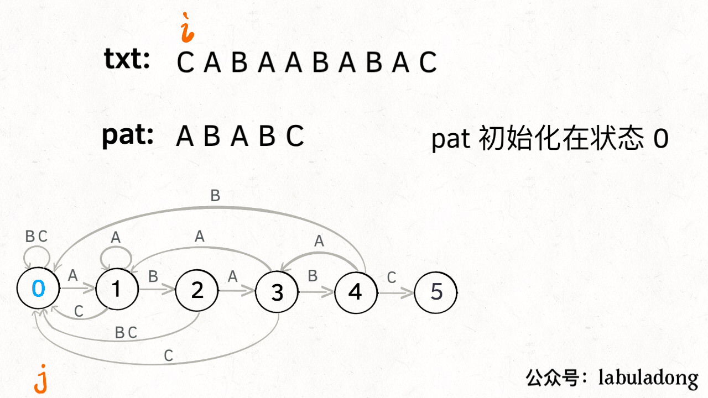

## Pergunta
Como o **Algoritmo KMP (Knuth-Morris-Pratt)** utiliza a tabela LPS para nunca retroceder o ponteiro do texto durante o casamento de padrões?

## Resposta
### Quick Answer
**Solução Direta**:
- A tabela **LPS (`pi[]`)** armazena o comprimento do maior prefixo próprio que também é sufixo para cada prefixo do padrão.
- Ao encontrar uma incompatibilidade (*mismatch*) no caractere $j$ do padrão após casar $j$ caracteres:
  - O KMP não reinicia a busca do texto; ele consulta **`j = lps[j - 1]`**.
  - Esse salto reaproveita os caracteres que já sabemos que casam com o início do padrão, mantendo o ponteiro do texto $i$ avançando **estritamente para a frente**.
- **Complexidade**: $O(N + M)$ tempo estrito garantido no pior caso e $O(M)$ espaço auxiliar.

### Dual Coding Visual

Visualização: Algoritmo KMP utilizando a tabela LPS para saltar comparações redundantes em tempo O(N+M).

| Comportamento em Mismatch | Ponteiro do Texto $i$ | Ponteiro do Padrão $j$ |
|---|---|---|
| **Busca Ingênua** | Retrocede para $i - j + 1$ | Reinicia em $0$ |
| **KMP (Knuth-Morris-Pratt)** | **Nunca retrocede** (Avança sempre) | Salta para `lps[j - 1]` |

Deep Dive & Walkthrough

#### Key Takeaways
- É o algoritmo canônico para garantir que o casamento de strings seja concluído em tempo estritamente determinístico $O(N + M)$ sem depender de hashing.

