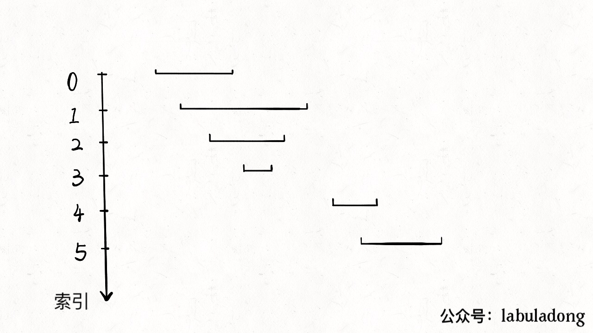

## Pergunta
Por que a ordenação preliminar dos intervalos por seu ponto de início (`start`) é a chave para resolver problemas de sobreposição em $O(N \log N)$?

## Resposta
### Quick Answer
**Solução Direta**:
- Sem ordenação, qualquer intervalo poderia sobrepor qualquer outro, exigindo comparações de todos os pares em $O(N^2)$.
- Ao ordenar os intervalos por $\text{start}_i$ em ordem crescente:
  - Garantimos que se um intervalo $B$ sobrepõe o intervalo $A$, então obrigatoriamente $\text{start}_A \le \text{start}_B$.
  - A sobreposição depende unicamente de verificar se o início do próximo intervalo é menor ou igual ao fim do intervalo atual: $\text{start}_B \le \text{end}_A$.
  - Isso reduz o processamento a uma única varredura linear $O(N)$ após a ordenação $O(N \log N)$.

### Dual Coding Visual

Visualização: Ordenação pelo início e fusão de intervalos sobrepostos ajustando o limite final em O(N log N).

| Estratégia de Intervalos | Comparações Necessárias | Complexidade Total |
|---|---|---|
| **Sem Ordenação** | Compara todos os pares $(i, j)$ | $O(N^2)$ |
| **Com Ordenação por Start** | Varredura linear sequencial | $O(N \log N)$ |

Deep Dive & Walkthrough

#### Key Takeaways
- Em qualquer problema envolvendo intervalos no LeetCode, o primeiro passo padrão deve ser ordenar por `start` (ou por `end` em problemas de agendamento guloso).

