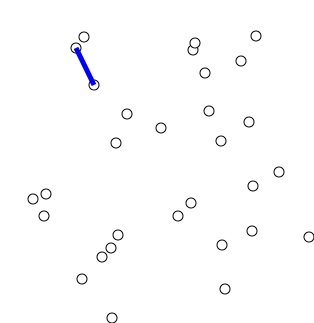

## Pergunta
Quais os critérios de escolha entre **Kruskal** e **Prim** com base na densidade de arestas do grafo?

## Resposta
### Quick Answer
**Solução Direta**:
- **Grafo Esparso ($E \ll V^2$, ex: $E = O(V)$)**:
  - **Kruskal** é preferível: $O(E \log E) = O(E \log V)$, com constante muito rápida e estruturas simples (DSU + lista de arestas).
- **Grafo Denso ($E \approx V^2$)**:
  - **Prim com Matriz de Adjacência ($O(V^2)$)** supera Kruskal (que custaria $O(V^2 \log V^2) = O(V^2 \log V)$).
- Para problemas geométricos em 2D com $N$ pontos onde todas as $N^2$ conexões existem (*Min Cost to Connect All Points*), Prim com array plano é a solução mais rápida.

### Dual Coding Visual

Visualização: Algoritmo de Prim expandindo a árvore geradora mínima nó a nó via aresta de menor corte.

| Densidade do Grafo | Algoritmo Recomendado | Complexidade Assintótica |
|---|---|---|
| **Esparso ($E \approx V$)** | Kruskal com DSU | $O(E \log E)$ |
| **Denso ($E \approx V^2$)** | Prim com Matriz | $O(V^2)$ |

Deep Dive & Walkthrough

#### Key Takeaways
- Prim sem Heap (apenas com array de distâncias mínimas) roda em estritos $O(V^2)$ sem custo de logaritmo em grafos completos.

