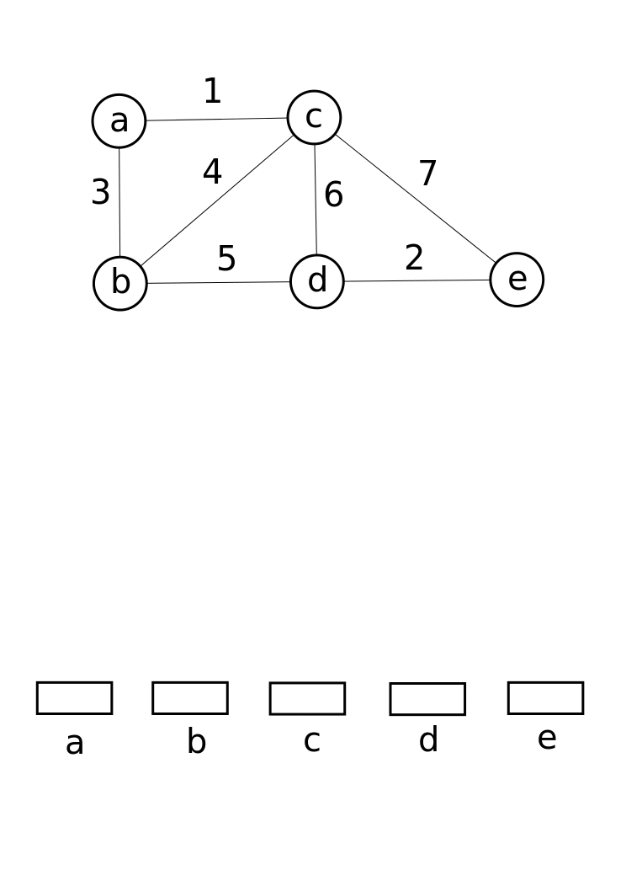

## Pergunta
Como o **Algoritmo de Kruskal** constrói a MST ordenando arestas e utilizando DSU em tempo $O(E \log E)$?

## Resposta
### Quick Answer
**Solução Direta**:
- O Algoritmo de Kruskal opera sob perspectiva de arestas globais:
  1. Ordena todas as $E$ arestas em ordem crescente de peso ($O(E \log E)$).
  2. Inicializa um DSU com $V$ conjuntos disjuntos.
  3. Itera sobre as arestas ordenadas: se os extremos da aresta pertencem a componentes diferentes (`dsu.union(u, v) == true`), adiciona a aresta à MST.
  4. Encerra ao acumular $V - 1$ arestas.

### Dual Coding Visual

Visualização: Estrutura Union-Find prevenindo a formação de ciclos durante o algoritmo de Kruskal.

| Passo de Kruskal | Estrutura Envolvida | Complexidade |
|---|---|---|
| **1. Ordenação Global** | `Arrays.sort(edges)` | $O(E \log E)$ |
| **2. Teste e Fusão** | $E$ chamadas no DSU | $O(E \cdot \alpha(V))$ |

Deep Dive & Walkthrough

#### Key Takeaways
- É extremamente simples de implementar e altamente eficiente para grafos esparsos ($E \approx V$).

