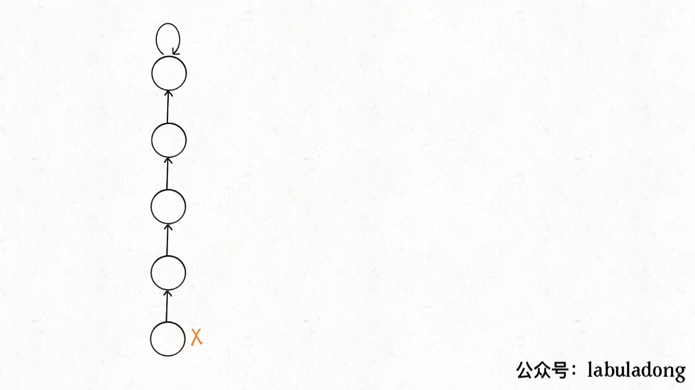

## Pergunta
O que é a estrutura de dados **Disjoint Set Union (DSU / Union-Find)** e qual problema ela modela?

## Resposta
### Quick Answer
**Solução Direta**:
- O **DSU (Union-Find)** mantém uma coleção de conjuntos disjuntos (não-sobrepostos) de elementos particionados.
- Cada conjunto é identificado por um **elemento representativo único (líder ou raiz)**.
- Suporta duas operações fundamentais:
  - **`find(x)`**: Retorna o líder do conjunto ao qual $x$ pertence.
  - **`union(x, y)`**: Funde os conjuntos que contêm $x$ e $y$ em um único conjunto.
- É a estrutura ideal para consultas dinâmicas de conectividade (*connected components*) em grafos.

### Dual Coding Visual

Visualização: Compressão de caminhos e união por rank no Disjoint Set Union gerando complexidade quase linear O(α(N)).

| Operação DSU | Propósito | Pergunta Respondida |
|---|---|---|
| **`find(x)`** | Localiza a raiz canônica do conjunto | "A qual grupo $x$ pertence?" |
| **`union(x, y)`** | Conecta dois grupos distintos | "Funda os grupos de $x$ e $y$" |

Deep Dive & Walkthrough

#### Key Takeaways
- Dois nós $A$ e $B$ estão conectados se e somente se `find(A) == find(B)`.

