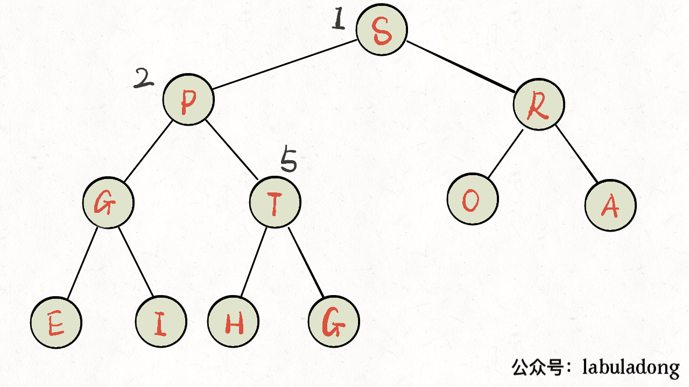

## Pergunta
O que é a propriedade estrutural e a invariante de ordenação de um **Heap Binário** (Min-Heap e Max-Heap)?

## Resposta
### Quick Answer
**Solução Direta**:
- Um Heap Binário é uma **Árvore Binária Completa** que satisfaz a invariante de heap:
  - **Min-Heap**: Para todo nó $i$, o valor do nó pai é menor ou igual ao valor de seus filhos ($\text{pai} \le \text{filhos}$). O elemento mínimo global reside sempre na **raiz** ($O(1)$).
  - **Max-Heap**: Para todo nó $i$, o valor do nó pai é maior ou igual ao de seus filhos ($\text{pai} \ge \text{filhos}$). O elemento máximo reside na raiz.
- A estrutura não impõe ordenação horizontal estrita entre nós irmãos, apenas vertical entre pais e descendentes.

### Dual Coding Visual

Visualização: Operação Sift-Up (Swim) promovendo o novo elemento na árvore binária até restaurar a invariante heap.

| Tipo de Heap | Invariante de Nó | Elemento na Raiz |
|---|---|---|
| **Min-Heap** | $\text{pai} \le \text{filhos}$ | Menor valor global ($O(1)$) |
| **Max-Heap** | $\text{pai} \ge \text{filhos}$ | Maior valor global ($O(1)$) |

Deep Dive & Walkthrough

#### Key Takeaways
- Como a árvore é completa, a altura é estritamente garantida como $H = \lfloor \log_2 N \rfloor$, evitando qualquer risco de degeneração.

