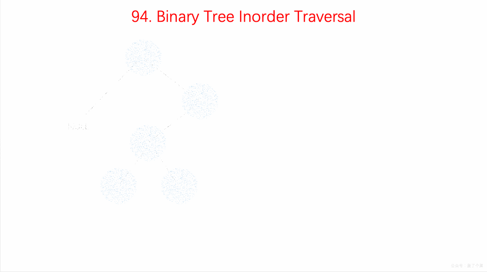

## Pergunta
Por que a travessia **In-order (Em-ordem)** visita os elementos de uma BST estritamente em ordem crescente?

## Resposta
### Quick Answer
**Solução Direta**:
- A travessia In-order segue a ordem recursiva rígida:
  1. Visitar recursivamente a **Subárvore Esquerda** (todos os nós $< \text{nó atual}$).
  2. Visitar o **Nó Atual** (valor mediano local).
  3. Visitar recursivamente a **Subárvore Direita** (todos os nós $> \text{nó atual}$).
- Pela própria invariante da BST, esse padrão garante que nenhum elemento maior seja processado antes de seus predecessores menores, gerando uma sequência monotônica estritamente ordenada em tempo linear $O(N)$.

### Dual Coding Visual

Visualização: Travessia In-Order (esquerda, raiz, direita) extraindo chaves em ordem estritamente crescente.

| Ordem de Travessia | Sequência de Passos | Propriedade em BST |
|---|---|---|
| **In-order** | Esquerda $\to$ Raiz $\to$ Direita | Produz array ordenado ($O(N)$) |
| **Pre-order** | Raiz $\to$ Esquerda $\to$ Direita | Serialização da árvore |
| **Post-order** | Esquerda $\to$ Direita $\to$ Raiz | Liberação de memória / Bottom-up |

Deep Dive & Walkthrough

#### Validação de BST (LeetCode 98)
Um método eficiente para validar se uma árvore binária é uma BST válida consiste em executar uma travessia in-order e verificar se cada elemento visitado é estritamente maior que o elemento anterior (`prev < curr.val`).

#### Key Takeaways
- A travessia In-order é a forma mais direta de recuperar todos os $N$ elementos ordenados de uma BST em $O(N)$ tempo e $O(H)$ espaço de pilha.

