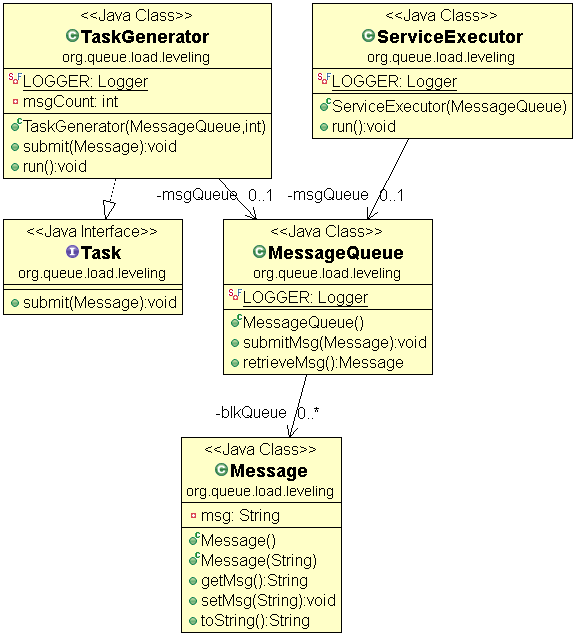

## Pergunta
Qual é a diferença conceitual entre o modelo Ponto a Ponto (Point-to-Point) e o modelo Publicação/Assinatura (Pub/Sub) em message brokers?

## Resposta
### Quick Answer
**Solução Direta**:
- **Ponto a Ponto (Queue / Worker Pool)**:
  - Cada mensagem enviada para a fila é processada por **exatamente um consumidor** entre os múltiplos workers disponíveis (*Competing Consumers*).
  - Ideal para distribuição balanceada de tarefas pesadas em background.
- **Publicação/Assinatura (Topic / Exchange)**:
  - O produtor publica a mensagem em um **Tópico/Fanout Exchange**.
  - A mensagem é copiada e entregue a **todos os assinantes inscritos** (cada serviço consumidor recebe sua própria cópia independente da mensagem).

### Dual Coding Visual

Visualização: Queue-Based Load Leveling amortecendo picos de tráfego entre produtores e consumidores assíncronos.

| Modelo de Mensageria | Quantidade de Consumidores por Mensagem | Caso de Uso Primário |
|---|---|---|
| **Point-to-Point (Queue)** | Exatamente 1 consumidor | Processamento de tarefas assíncronas |
| **Publish-Subscribe (Topic)** | Múltiplos consumidores (Broadcast) | Disseminação de eventos de domínio |

Deep Dive & Walkthrough

#### Exemplo Prático: Evento `OrderPlaced`
- No modelo Pub/Sub, o evento `OrderPlaced` é entregue simultaneamente para:
  1. `PaymentWorkerQueue` (cobrar o cartão).
  2. `InventoryWorkerQueue` (reservar itens).
  3. `NotificationWorkerQueue` (enviar e-mail de confirmação).

