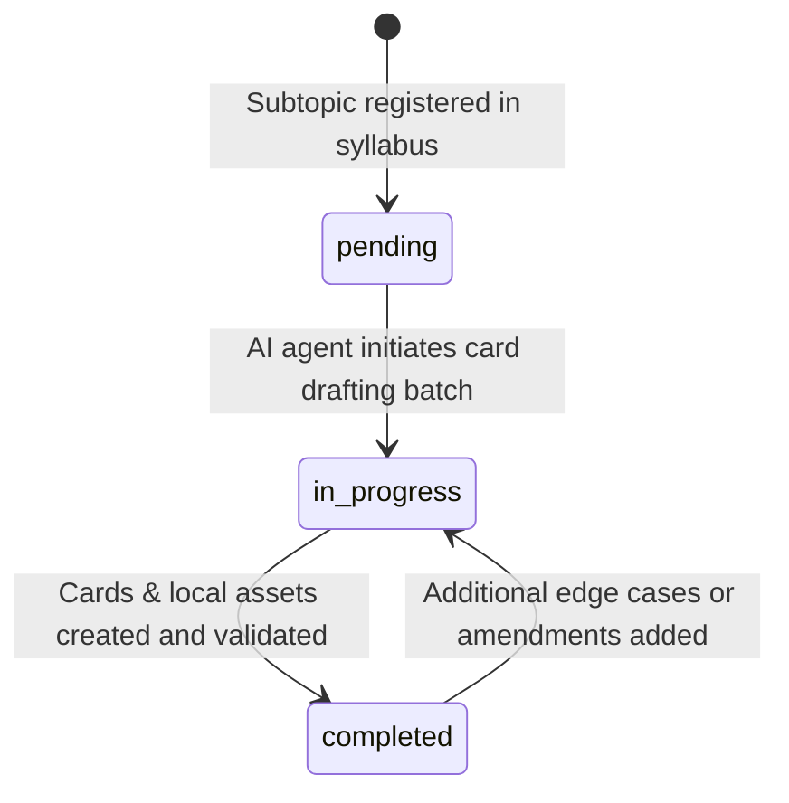

# Data Model: FAANG/MAANG Anki Deck Engine

**Feature**: `001-faang-anki-deck`
**Date**: 2026-08-16

## 1. Core Entities

### 1.1 FlashcardDocument (Markdown File)
Represents a single atomic learning item persisted on the filesystem.

- **Path Pattern**: `decks/<fase_id>/<modulo>/<subtopico>/<card_id>.md`
- **Fields**:
  - `frontmatter`: YAML object conforming to `FlashcardFrontmatter`.
  - `pergunta`: Markdown string under `## Pergunta`.
  - `resposta`: Markdown string under `## Resposta`, structured into:
    - `quickAnswer`: Short atomic explanation + Big-O complexity badges.
    - `dualCodingVisual`: Inline SVG, Markdown comparison table, or local asset image.
    - `deepDive`: Collapsible `<details><summary>Deep Dive & Walkthrough</summary>...</details>` containing Go/Java code and trade-offs.

### 1.2 FlashcardFrontmatter
- `id` (*string*, required, regex: `^[A-Z0-9]+-[A-Z0-9]+-[A-Z0-9]+-[0-9]{3}$`): Canonical deterministic identifier (e.g. `CS-ARCH-CACHE-001`).
- `title` (*string*, required): Short descriptive title.
- `tags` (*array of strings*, required): List of hierarchical tags:
  - `level::<l3-junior|l4-pleno|l5-senior>` (Exactly one required)
  - `topic::<phase>::<subtopic>` (At least one required)
  - `company::<company_name>` (Optional/Recommended)
  - `freq::<high|medium|low>` (Exactly one required)

### 1.3 CurriculumManifest (`syllabus_manifest.json`)
The central registry tracking curriculum coverage.

```json
{
  "version": "1.0.0",
  "last_updated": "2026-08-16",
  "phases": [
    {
      "id": "02-cs-fundamentals",
      "title": "Fundamentos da Ciência da Computação",
      "modules": [
        {
          "id": "architecture",
          "title": "Arquitetura de Computadores",
          "subtopics": [
            {
              "id": "cpu-cache",
              "title": "Hierarquia de Caches (L1, L2, L3, RAM)",
              "status": "completed",
              "card_ids": ["CS-ARCH-CACHE-001"]
            }
          ]
        }
      ]
    }
  ]
}
```

### 1.4 Subtopic Lifecycle & State Transitions



---

## 2. Validation Rules

1. **Tag Integrity**: Every card MUST contain at least one `level::*`, one `topic::*`, and one `freq::*` tag.
2. **Deterministic Uniqueness**: No two `.md` files may share the same `id`.
3. **Section Headings**: Every card file MUST contain exactly one `## Pergunta` and one `## Resposta`.
4. **Mobile Line Wrapping**: Code blocks MUST NOT contain long uninterrupted lines (>80 chars without whitespace) that force horizontal scrolling.
5. **Asset Reference Co-location**: Any image referenced in markdown must exist in the local `assets/` subfolder relative to the card.
