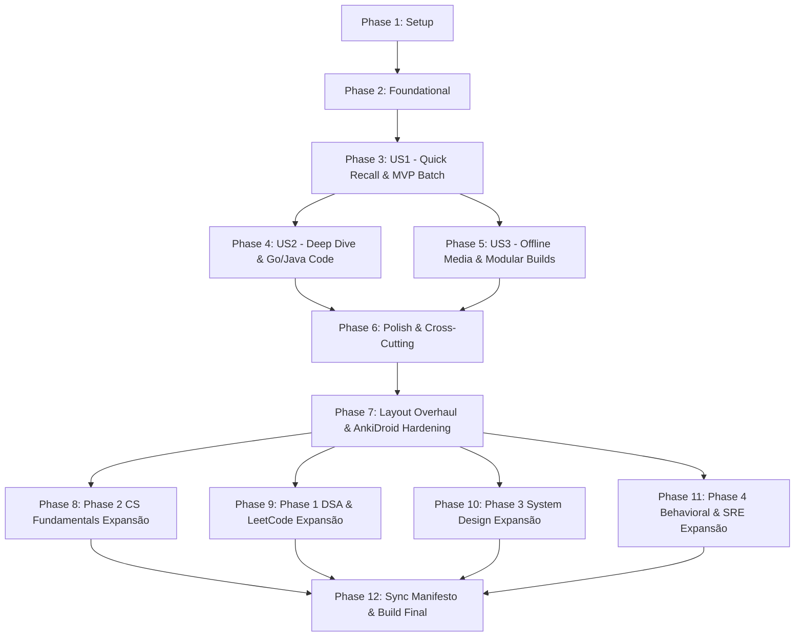

# Tasks: FAANG/MAANG Anki Deck & Pedagogical Engine

**Feature**: `001-faang-anki-deck` | **Spec**: [spec.md](./spec.md) | **Plan**: [plan.md](./plan.md)

---

## Phase 1: Setup (Shared Infrastructure)

**Purpose**: Project initialization, dependency verification, and curriculum catalog baseline

- [X] T001 Verify and update project dependencies (`anki-apkg-export`, `gray-matter`, `marked`, `sql.js`, `highlight.js`) in `package.json`
- [X] T002 [P] Create initial curriculum registry conforming to `manifest-schema.json` in `syllabus_manifest.json`
- [X] T003 [P] Create granular directory structure for Phase 2 CS Fundamentals in `decks/02-cs-fundamentals/architecture/cpu-cache/assets` and `decks/02-cs-fundamentals/discrete-math/boolean-logic/assets`

---

## Phase 2: Foundational (Blocking Prerequisites)

**Purpose**: Core validation, media crawling, and styling engine that MUST be complete before card generation and packaging

**⚠️ CRITICAL**: No user story packaging or card validation can proceed until this phase is complete

- [X] T004 Implement frontmatter and markdown schema validator in `src/utils/validator.js`
- [X] T005 [P] Implement co-located media crawler and URL rewriter in `src/utils/media-resolver.js`
- [X] T006 [P] Implement mobile-first CSS design system (dark/light themes, touch accordion, zero-scroll code) in `src/generator.js`

**Checkpoint**: Foundation ready — card authoring and packaging pipeline can now begin

---

## Phase 3: User Story 1 - Quick Concept Review & Pattern Recognition on Mobile (Priority: P1) 🎯 MVP

**Goal**: Enable mobile micro-learning recall (<15s) with dual coding visual cues (tables/SVG) and atomic quick answers for Phase 2 CS Fundamentals.

**Independent Test**: Build `MAANG_Engineering_Mastery.apkg` with Phase 2 CS Fundamentals cards; verify on mobile screen (≥360px) that question displays in PT-BR with English terms and flipped back reveals quick answer and visual cue immediately without clicks.

### Implementation for User Story 1

- [X] T007 [US1] Update card parser in `src/generator.js` to process `## Pergunta` and `## Resposta` sections with tag badges
- [X] T008 [P] [US1] Create atomic card for L1/L2/L3 cache vs RAM latency hierarchy in `decks/02-cs-fundamentals/architecture/cpu-cache/CS-ARCH-CACHE-001.md`
- [X] T009 [P] [US1] Create atomic card for Cache Line (64-byte) & Spatial Locality in `decks/02-cs-fundamentals/architecture/cpu-cache/CS-ARCH-CACHE-002.md`
- [X] T010 [P] [US1] Create atomic card for Branch Prediction & Pipeline Stalls in `decks/02-cs-fundamentals/architecture/cpu-cache/CS-ARCH-CACHE-003.md`
- [X] T011 [P] [US1] Create atomic card for Bitwise Operations (XOR swap, power of 2) in `decks/02-cs-fundamentals/discrete-math/boolean-logic/CS-MATH-BOOL-001.md`
- [X] T012 [P] [US1] Create atomic card for Two's Complement & Overflow representation in `decks/02-cs-fundamentals/discrete-math/boolean-logic/CS-MATH-BOOL-002.md`
- [X] T013 [P] [US1] Create atomic card for Virtual Memory & TLB hierarchy in `decks/02-cs-fundamentals/os-memory/virtual-memory/CS-OS-VMEM-001.md`
- [X] T014 [US1] Register generated card IDs (`CS-ARCH-CACHE-001` through `CS-OS-VMEM-001`) and update subtopic statuses in `syllabus_manifest.json`

**Checkpoint**: User Story 1 (MVP) is fully functional and delivers a cohesive set of Phase 2 CS Fundamentals flashcards.

---

## Phase 4: User Story 2 - Deep Dive & Code Implementation Inspection (Priority: P2)

**Goal**: Deliver collapsible deep dive walkthroughs with idiomatic Go and Java code snippets and trade-off analyses with zero horizontal scrolling.

**Independent Test**: Expand the `

Deep Dive & Walkthrough
` section on flipped cards on mobile viewports; verify Go and Java code blocks wrap cleanly without horizontal scrollbars.

### Implementation for User Story 2

- [X] T015 [US2] Enhance markdown rendering in `src/generator.js` to ensure clean `
` accordion formatting and mobile code wrapping
- [X] T016 [P] [US2] Add Go and Java bitwise manipulation implementations and trade-offs to `decks/02-cs-fundamentals/discrete-math/boolean-logic/CS-MATH-BOOL-001.md`
- [X] T017 [P] [US2] Add Go and Java two's complement and bit-masking snippets to `decks/02-cs-fundamentals/discrete-math/boolean-logic/CS-MATH-BOOL-002.md`
- [X] T018 [P] [US2] Add Go and Java false sharing & cache line padding demonstrations to `decks/02-cs-fundamentals/architecture/cpu-cache/CS-ARCH-CACHE-002.md`
- [X] T019 [P] [US2] Add deep dive trade-off analysis on Page Tables and HugePages to `decks/02-cs-fundamentals/os-memory/virtual-memory/CS-OS-VMEM-001.md`

**Checkpoint**: User Stories 1 AND 2 are complete — cards provide both immediate recall (<15s) and full technical depth on demand.

---

## Phase 5: User Story 3 - Offline Multi-Topic Filtered Review & Modular Builds (Priority: P3)

**Goal**: Provide 100% offline packaging with co-located local media embedding and support multi-target builds (consolidated master `.apkg` and modular phase-specific `.apkg`).

**Independent Test**: Run `node src/generator.js --phase 02-cs-fundamentals` and `npm run build`, import both `.apkg` packages into Anki in airplane mode, and verify offline media rendering and tag-filtered study.

### Implementation for User Story 3

- [X] T020 [US3] Implement CLI arguments parsing (`--phase <phase_id>`) and multi-target packaging logic in `src/generator.js`
- [X] T021 [US3] Integrate binary media bundling via `apkg.addMedia()` in `src/generator.js` using `src/utils/media-resolver.js`
- [X] T022 [P] [US3] Add co-located local visual diagrams to `decks/02-cs-fundamentals/architecture/cpu-cache/assets/CS-ARCH-CACHE-002.svg` and `decks/02-cs-fundamentals/os-memory/virtual-memory/assets/CS-OS-VMEM-001.svg`
- [X] T023 [US3] Validate tag taxonomy hierarchy indexing and filtering across exported `.apkg` packages in `src/generator.js`

**Checkpoint**: All user stories functional — complete offline-first operation and modular multi-target builds verified.

---

## Phase 6: Polish & Cross-Cutting Concerns

**Purpose**: Automated validation, test suite integration, and complete documentation

- [X] T024 [P] Create automated validation test script in `test/validate-cards.test.js` checking all cards against `contracts/card-schema.json` and `constitution.md`
- [X] T025 Add `test` script entry to `package.json` running card validation
- [X] T026 [P] Update documentation with syllabus manifest workflow and build guide in `README.md`
- [X] T027 Run end-to-end verification following `specs/001-faang-anki-deck/quickstart.md`

---

## Phase 7: Layout Overhaul, Syntax Highlighting & AnkiDroid Hardening

**Purpose**: Fix visual layout regressions, eliminate template duplication on card back, integrate offline build-time syntax highlighting (`highlight.js`) and ensure responsive tables for mobile micro-learning.

- [X] T028 [P] Enhance `src/utils/validator.js` to enforce code block language declarations and table column limits (max 3 cols for mobile)
- [X] T029 [P] Integrate `highlight.js` with Dark Modern tokenization and responsive table wrapper (`.table-responsive`) in `src/generator.js`
- [X] T030 Refactor CSS in `src/generator.js` with valid night mode selectors (`.nightMode`, `.night_mode`, `@media`) and AnkiDroid mobile-first resets
- [X] T031 Configure isolated single-container template architecture (`answerFormat: '{{Back}}'`) in `src/generator.js`
- [X] T032 [P] Refactor 4-column latency table in `decks/02-cs-fundamentals/architecture/cpu-cache/CS-ARCH-CACHE-001.md` to responsive 3-column format
- [X] T033 Run automated validation test suite and verify `.apkg` build outputs

---

## Phase 8: Curriculum Expansion - Phase 2 CS Fundamentals (20 Subtopics)

**Goal**: Deliver entry-level intuitive mental models and technical deep-dives for all remaining computer science foundation subtopics.

### Arquitetura de Computadores e Hardware
- [X] T034 [P] [CS-FUND] Author entry-level visual/intuitive card & deep-dive card for Pipeline de Instruções, Hazards & Branch Prediction in `decks/02-cs-fundamentals/architecture/pipelining-branch-prediction/CS-ARCH-PIPE-001.md`
- [X] T035 [P] [CS-FUND] Author entry-level visual/intuitive card & deep-dive card for Registradores, Stack Frames, Calling Conventions & NUMA in `decks/02-cs-fundamentals/architecture/cpu-internals-isa/CS-ARCH-CPU-001.md`
- [X] T036 [P] [CS-FUND] Author entry-level visual/intuitive card & deep-dive card for SSD NVMe vs HDD, Random vs Sequential I/O, Page Cache & DMA in `decks/02-cs-fundamentals/architecture/storage-io-hierarchy/CS-ARCH-IO-001.md`

### Sistemas Operacionais, Gestão de Memória & Concorrência
- [X] T037 [P] [CS-FUND] Author entry-level visual/intuitive card & deep-dive card for Processos vs Threads, Context Switch Overhead & Goroutines in `decks/02-cs-fundamentals/os-memory/processes-threads/CS-OS-PROC-001.md`
- [X] T038 [P] [CS-FUND] Author entry-level visual/intuitive card & deep-dive card for Primitivas de Sincronização (Mutex, Semáforos, RW-Lock, Deadlocks) in `decks/02-cs-fundamentals/os-memory/synchronization-primitives/CS-OS-SYNC-001.md`
- [X] T039 [P] [CS-FUND] Author entry-level visual/intuitive card & deep-dive card for Atomics, CAS, Memory Barriers, Volatile & Lock-Free Buffers in `decks/02-cs-fundamentals/os-memory/lock-free-atomics/CS-OS-ATOM-001.md`
- [X] T040 [P] [CS-FUND] Author entry-level visual/intuitive card & deep-dive card for Linux I/O Syscalls (select, poll, epoll, sendfile, io_uring) in `decks/02-cs-fundamentals/os-memory/linux-io-syscalls/CS-OS-SYSCALL-001.md`
- [X] T041 [P] [CS-FUND] Author entry-level visual/intuitive card & deep-dive card for Escalonador CFS, Cgroups, Containers, Signals & OOM Killer in `decks/02-cs-fundamentals/os-memory/linux-kernel-process-management/CS-OS-KERN-001.md`
- [X] T042 [P] [CS-FUND] Author entry-level visual/intuitive card & deep-dive card for Comunicação Inter-Processos (IPC: Unix Sockets, Pipes, Shared Memory) in `decks/02-cs-fundamentals/os-memory/ipc-inter-process-communication/CS-OS-IPC-001.md`

### Runtimes, Gerenciamento de Memória & Garbage Collection (Go & JVM)
- [X] T043 [P] [CS-FUND] Author entry-level visual/intuitive card & deep-dive card for Layout de Memória JVM e Coletores GC (G1, ZGC, Shenandoah) in `decks/02-cs-fundamentals/runtimes-garbage-collection/jvm-memory-gc/CS-RUN-JVM-001.md`
- [X] T044 [P] [CS-FUND] Author entry-level visual/intuitive card & deep-dive card for Go Runtime (Modelo GMP, GC Tri-Color, Write Barrier, GOMEMLIMIT) in `decks/02-cs-fundamentals/runtimes-garbage-collection/go-runtime-gc/CS-RUN-GO-001.md`
- [X] T045 [P] [CS-FUND] Author entry-level visual/intuitive card & deep-dive card for Alocação Stack vs Heap, Escape Analysis em Go/Java & Off-Heap in `decks/02-cs-fundamentals/runtimes-garbage-collection/memory-allocation-escape-analysis/CS-RUN-MEM-001.md`

### Redes de Computadores para Engenharia Backend
- [X] T046 [P] [CS-FUND] Author entry-level visual/intuitive card & deep-dive card for TCP vs UDP, 3-Way Handshake, Congestion Control (BBR) & HoL Blocking in `decks/02-cs-fundamentals/networking/tcp-udp-transport/CS-NET-TCP-001.md`
- [X] T047 [P] [CS-FUND] Author entry-level visual/intuitive card & deep-dive card for Evolução HTTP (HTTP/1.1 Pipelining, HTTP/2 Multiplexing, HTTP/3 QUIC) in `decks/02-cs-fundamentals/networking/http-protocols/CS-NET-HTTP-001.md`
- [X] T048 [P] [CS-FUND] Author entry-level visual/intuitive card & deep-dive card for Hierarquia DNS, Resolução Recursiva, Handshake TLS 1.3 & PKI in `decks/02-cs-fundamentals/networking/dns-tls/CS-NET-DNS-001.md`
- [X] T049 [P] [CS-FUND] Author entry-level visual/intuitive card & deep-dive card for Sockets TCP, SO_RCVBUF, TCP_NODELAY, TIME_WAIT & Keep-Alive in `decks/02-cs-fundamentals/networking/socket-io-epoll/CS-NET-SOCK-001.md`
- [X] T050 [P] [CS-FUND] Author entry-level visual/intuitive card & deep-dive card for Protocolos Modernos (WebSockets, SSE, gRPC Protobuf & GraphQL) in `decks/02-cs-fundamentals/networking/modern-apis-protocols/CS-NET-API-001.md`

### Matemática Discreta, Baixo Nível & Teoria da Computação
- [X] T051 [P] [CS-FUND] Author entry-level visual/intuitive card & deep-dive card for Representação Numérica (Complemento de Dois, IEEE 754, Endianness) in `decks/02-cs-fundamentals/discrete-math/number-representation-ieee754/CS-MATH-NUM-001.md`
- [X] T052 [P] [CS-FUND] Author entry-level visual/intuitive card & deep-dive card for Combinatória e Probabilidade (Bayes, Birthday Paradox em Hashes) in `decks/02-cs-fundamentals/discrete-math/combinatorics-probability/CS-MATH-PROB-001.md`
- [X] T053 [P] [CS-FUND] Author entry-level visual/intuitive card & deep-dive card for Teoria dos Grafos, DAGs, Conectividade & Indução Matemática in `decks/02-cs-fundamentals/discrete-math/graph-theory/CS-MATH-GRAPH-001.md`

---

## Phase 9: Curriculum Expansion - Phase 1 DSA & LeetCode (30 Subtopics)

**Goal**: Deliver intuitive first-principles pattern models and optimal Go/Java implementations across fundamental data structures and algorithmic patterns.

### Estruturas de Dados Fundamentais e Avançadas
- [X] T054 [P] [DSA] Author entry-level visual/intuitive card & deep-dive card for Vetores Dinâmicos, Strings & Buffers Contíguos in `decks/01-dsa/data-structures/arrays-strings/DSA-STRUCT-ARRAY-001.md`
- [X] T055 [P] [DSA] Author entry-level visual/intuitive card & deep-dive card for Listas Ligadas Simples, Duplas & Skip Lists in `decks/01-dsa/data-structures/linked-lists/DSA-STRUCT-LIST-001.md`
- [X] T056 [P] [DSA] Author entry-level visual/intuitive card & deep-dive card for Pilhas, Filas Circulares, Deques & Monotonic Stacks in `decks/01-dsa/data-structures/stacks-queues/DSA-STRUCT-STACK-001.md`
- [X] T057 [P] [DSA] Author entry-level visual/intuitive card & deep-dive card for Árvores Binárias, BST, AVL & Red-Black Trees in `decks/01-dsa/data-structures/trees-bst/DSA-STRUCT-TREE-001.md`
- [X] T058 [P] [DSA] Author entry-level visual/intuitive card & deep-dive card for Min/Max Heap Binário, K-Way Heaps & Priority Queues in `decks/01-dsa/data-structures/heaps-priority-queues/DSA-STRUCT-HEAP-001.md`
- [X] T059 [P] [DSA] Author entry-level visual/intuitive card & deep-dive card for Representações de Grafos (Lista e Matriz de Adjacência) in `decks/01-dsa/data-structures/graphs-representations/DSA-STRUCT-GRAPH-001.md`
- [X] T060 [P] [DSA] Author entry-level visual/intuitive card & deep-dive card for Árvore de Prefixos Trie, Radix Trees & Bitwise Trie in `decks/01-dsa/data-structures/trie-prefix-tree/DSA-STRUCT-TRIE-001.md`
- [X] T061 [P] [DSA] Author entry-level visual/intuitive card & deep-dive card for Tabelas Hash, Colisão, Open Addressing & LRU Cache in `decks/01-dsa/data-structures/hash-tables/DSA-STRUCT-HASH-001.md`
- [X] T062 [P] [DSA] Author entry-level visual/intuitive card & deep-dive card for Segment Tree com Lazy Propagation & Fenwick Tree in `decks/01-dsa/data-structures/advanced-trees/DSA-STRUCT-ADVTREE-001.md`
- [X] T063 [P] [DSA] Author entry-level visual/intuitive card & deep-dive card for Disjoint Set Union (Union-Find) com Rank & Path Compression in `decks/01-dsa/data-structures/disjoint-set-union/DSA-STRUCT-DSU-001.md`

### Padrões Algorítmicos FAANG & Resolução de Problemas
- [X] T064 [P] [DSA] Author entry-level visual/intuitive card & deep-dive card for Two Pointers (Opostos, Fast & Slow Pointers) in `decks/01-dsa/algorithmic-patterns/two-pointers/DSA-PATT-2POINT-001.md`
- [X] T065 [P] [DSA] Author entry-level visual/intuitive card & deep-dive card for Sliding Window (Tamanho Fixo e Dinâmico) in `decks/01-dsa/algorithmic-patterns/sliding-window/DSA-PATT-SLIDE-001.md`
- [X] T066 [P] [DSA] Author entry-level visual/intuitive card & deep-dive card for Busca Binária Clássica, Arrays Rotacionados & Predicado Monótono in `decks/01-dsa/algorithmic-patterns/binary-search/DSA-PATT-BSEARCH-001.md`
- [X] T067 [P] [DSA] Author entry-level visual/intuitive card & deep-dive card for Monotonic Stack & Queue (Next Greater Element, Histogram) in `decks/01-dsa/algorithmic-patterns/monotonic-stack-queue/DSA-PATT-MONOSTACK-001.md`
- [X] T068 [P] [DSA] Author entry-level visual/intuitive card & deep-dive card for BFS, DFS, Multi-Source BFS, Flood Fill & Conexões in `decks/01-dsa/algorithmic-patterns/bfs-dfs-traversals/DSA-PATT-TRAVERSAL-001.md`
- [X] T069 [P] [DSA] Author entry-level visual/intuitive card & deep-dive card for Ordenação Topológica (Kahn In-degree & DFS DAG Cycle Check) in `decks/01-dsa/algorithmic-patterns/topological-sort/DSA-PATT-TOPO-001.md`
- [X] T070 [P] [DSA] Author entry-level visual/intuitive card & deep-dive card for Caminhos Mínimos (Dijkstra, Bellman-Ford, Floyd-Warshall, A*) in `decks/01-dsa/algorithmic-patterns/shortest-path-algorithms/DSA-PATT-SPATH-001.md`
- [X] T071 [P] [DSA] Author entry-level visual/intuitive card & deep-dive card for Árvore Geradora Mínima (Kruskal com DSU & Prim) in `decks/01-dsa/algorithmic-patterns/minimum-spanning-tree/DSA-PATT-MST-001.md`
- [X] T072 [P] [DSA] Author entry-level visual/intuitive card & deep-dive card for Programação Dinâmica 1D (Kadane, House Robber, LIS, Coin Change) in `decks/01-dsa/algorithmic-patterns/dynamic-programming-1d/DSA-PATT-DP1D-001.md`
- [X] T073 [P] [DSA] Author entry-level visual/intuitive card & deep-dive card for Programação Dinâmica 2D (0/1 Knapsack, LCS, Edit Distance) in `decks/01-dsa/algorithmic-patterns/dynamic-programming-2d/DSA-PATT-DP2D-001.md`
- [X] T074 [P] [DSA] Author entry-level visual/intuitive card & deep-dive card for DP Avançada (Bitmask DP, Digit DP, Tree DP, Interval DP) in `decks/01-dsa/algorithmic-patterns/dynamic-programming-advanced/DSA-PATT-DPADV-001.md`
- [X] T075 [P] [DSA] Author entry-level visual/intuitive card & deep-dive card for Backtracking (Subsets, Permutations, N-Queens, Sudoku) in `decks/01-dsa/algorithmic-patterns/backtracking/DSA-PATT-BACKTRACK-001.md`
- [X] T076 [P] [DSA] Author entry-level visual/intuitive card & deep-dive card for Algoritmos Gulosos (Interval Scheduling, Jump Game, Huffman) in `decks/01-dsa/algorithmic-patterns/greedy-algorithms/DSA-PATT-GREEDY-001.md`
- [X] T077 [P] [DSA] Author entry-level visual/intuitive card & deep-dive card for Manipulação de Intervalos (Merge, Insert, Meeting Rooms) in `decks/01-dsa/algorithmic-patterns/intervals-merge/DSA-PATT-INTERVAL-001.md`
- [X] T078 [P] [DSA] Author entry-level visual/intuitive card & deep-dive card for Manipulação de Bits & Bitmasks (XOR Tricks, Single Number) in `decks/01-dsa/algorithmic-patterns/bit-manipulation-patterns/DSA-PATT-BIT-001.md`
- [X] T079 [P] [DSA] Author entry-level visual/intuitive card & deep-dive card for Divisão e Conquista (Merge Sort, Quickselect, Teorema Mestre) in `decks/01-dsa/algorithmic-patterns/divide-and-conquer-sorting/DSA-PATT-DIVCONQ-001.md`

### Algoritmos Avançados, Teoria dos Jogos & Concorrência
- [X] T080 [P] [DSA] Author entry-level visual/intuitive card & deep-dive card for Casamento de Padrões em Strings (KMP, Rabin-Karp Rolling Hash) in `decks/01-dsa/advanced-dsa-string-math/string-matching/DSA-ADV-STRING-001.md`
- [X] T081 [P] [DSA] Author entry-level visual/intuitive card & deep-dive card for Teoria dos Jogos & Matemática (Minimax Alpha-Beta, Fast Power, Crivo) in `decks/01-dsa/advanced-dsa-string-math/game-theory-math/DSA-ADV-GAMETHEORY-001.md`
- [X] T082 [P] [DSA] Author entry-level visual/intuitive card & deep-dive card for Geometria Computacional & Linha de Varredura (Sweep-Line, Skyline) in `decks/01-dsa/advanced-dsa-string-math/sweepline-geometry/DSA-ADV-SWEEPLINE-001.md`
- [X] T083 [P] [DSA] Author entry-level visual/intuitive card & deep-dive card for Estruturas de Dados Concorrentes (Lock-Free Queue, Disruptor) in `decks/01-dsa/advanced-dsa-string-math/concurrent-data-structures/DSA-ADV-CONCURRENT-001.md`

---

## Phase 10: Curriculum Expansion - Phase 3 System Design & Backend Architecture (43 Subtopics)

**Goal**: Deliver scalable distributed systems architectural intuition, trade-off matrices, and FAANG case study designs.

### Fundamentos de System Design & Cálculos de Ordem de Grandeza
- [X] T084 [P] [SYS-DES] Author entry-level visual/intuitive card & deep-dive card for Estimativas Rápidas (Latências Jeff Dean, QPS, IOPS, Storage) in `decks/03-system-design-backend/system-design-foundations/back-of-the-envelope-estimations/SYS-FND-ESTIMATION-001.md`
- [X] T085 [P] [SYS-DES] Author entry-level visual/intuitive card & deep-dive card for Framework de Entrevistas de System Design em 4 Passos in `decks/03-system-design-backend/system-design-foundations/system-design-interview-framework/SYS-FND-FRAMEWORK-001.md`

### Princípios Fundamentais de Sistemas Distribuídos
- [X] T086 [P] [SYS-DES] Author entry-level visual/intuitive card & deep-dive card for Teoremas CAP & PACELC e Modelos de Consistência (Linearizability a Eventual) in `decks/03-system-design-backend/distributed-systems/cap-pacelc-consistency/SYS-DIST-CONSISTENCY-001.md`
- [X] T087 [P] [SYS-DES] Author entry-level visual/intuitive card & deep-dive card for Algoritmos de Consenso (Raft, Paxos, Quorums R+W>N) in `decks/03-system-design-backend/distributed-systems/consensus-replication/SYS-DIST-CONSENSUS-001.md`
- [X] T088 [P] [SYS-DES] Author entry-level visual/intuitive card & deep-dive card for Transações Distribuídas (2PC, Saga Choreography/Orchestration, Outbox) in `decks/03-system-design-backend/distributed-systems/distributed-transactions/SYS-DIST-TX-001.md`
- [X] T089 [P] [SYS-DES] Author entry-level visual/intuitive card & deep-dive card for Particionamento & Consistent Hashing com Virtual Nodes in `decks/03-system-design-backend/distributed-systems/sharding-consistent-hashing/SYS-DIST-SHARDING-001.md`
- [X] T090 [P] [SYS-DES] Author entry-level visual/intuitive card & deep-dive card for Coordenação & Bloqueios Distribuídos (etcd, ZooKeeper, Redlock, Fencing) in `decks/03-system-design-backend/distributed-systems/distributed-locking-coordination/SYS-DIST-LOCK-001.md`
- [X] T091 [P] [SYS-DES] Author entry-level visual/intuitive card & deep-dive card for Tempo em Sistemas Distribuídos (Lamport, Vector Clocks, Snowflake, UUIDv7) in `decks/03-system-design-backend/distributed-systems/time-clocks-id-generation/SYS-DIST-TIME-001.md`

### Bancos de Dados & Mecanismos de Armazenamento Interno
- [X] T092 [P] [SYS-DES] Author entry-level visual/intuitive card & deep-dive card for Storage Engines (B+Trees vs LSM-Trees, WAL, SSTables & Parquet) in `decks/03-system-design-backend/databases-storage/storage-engines/SYS-DB-ENGINE-001.md`
- [X] T093 [P] [SYS-DES] Author entry-level visual/intuitive card & deep-dive card for Otimização SQL (Índices Clustered, Leftmost Prefix, EXPLAIN ANALYZE, Joins) in `decks/03-system-design-backend/databases-storage/sql-indexing-optimization/SYS-DB-SQLOPT-001.md`
- [X] T094 [P] [SYS-DES] Author entry-level visual/intuitive card & deep-dive card for ACID & Níveis de Isolamento (Dirty Read, Write Skew, MVCC, SSI) in `decks/03-system-design-backend/databases-storage/acid-isolation-levels/SYS-DB-ACID-001.md`
- [X] T095 [P] [SYS-DES] Author entry-level visual/intuitive card & deep-dive card for Modelagem NoSQL (Document, DynamoDB Key-Value, Cassandra Wide-Column, Graph) in `decks/03-system-design-backend/databases-storage/nosql-data-modeling/SYS-DB-NOSQL-001.md`
- [X] T096 [P] [SYS-DES] Author entry-level visual/intuitive card & deep-dive card for Mecanismos de Busca & Vetores (Elasticsearch Inverted Index, HNSW, pgvector) in `decks/03-system-design-backend/databases-storage/vector-databases-search/SYS-DB-VECTOR-001.md`
- [X] T097 [P] [SYS-DES] Author entry-level visual/intuitive card & deep-dive card for Escala de Bancos de Dados (Read Replicas, Multi-Region, Sharding, CDC Debezium) in `decks/03-system-design-backend/databases-storage/scaling-replication-cdc/SYS-DB-SCALING-001.md`

### Estratégias de Cache & Entrega de Conteúdo
- [X] T098 [P] [SYS-DES] Author entry-level visual/intuitive card & deep-dive card for Padrões de Cache (Cache-Aside, Write-Through, Write-Back & Políticas LRU/TinyLFU) in `decks/03-system-design-backend/caching-cdn/caching-patterns/SYS-CACHE-PATTERNS-001.md`
- [X] T099 [P] [SYS-DES] Author entry-level visual/intuitive card & deep-dive card for Anomalias de Cache (Cache Stampede/Thundering Herd, Penetration, Avalanche) in `decks/03-system-design-backend/caching-cdn/cache-invalidation-anomalies/SYS-CACHE-ANOMALIES-001.md`
- [X] T100 [P] [SYS-DES] Author entry-level visual/intuitive card & deep-dive card for Arquitetura Interna do Redis (Event Loop, SDS, ZSet, RDB/AOF, Cluster) in `decks/03-system-design-backend/caching-cdn/redis-internals/SYS-CACHE-REDIS-001.md`
- [X] T101 [P] [SYS-DES] Author entry-level visual/intuitive card & deep-dive card for CDNs e Edge Computing (PoPs, Edge Caching, Cache-Control, ETag, Anycast) in `decks/03-system-design-backend/caching-cdn/cdn-edge-caching/SYS-CACHE-CDN-001.md`

### Mensageria, Filas & Arquiteturas Orientadas a Eventos
- [X] T102 [P] [SYS-DES] Author entry-level visual/intuitive card & deep-dive card for Filas de Mensagens (RabbitMQ, SQS, AMQP, Pub/Sub, DLQ, Visibility Timeout) in `decks/03-system-design-backend/messaging-streaming/message-queues/SYS-MSG-QUEUES-001.md`
- [X] T103 [P] [SYS-DES] Author entry-level visual/intuitive card & deep-dive card for Arquitetura do Apache Kafka (Append-Only Log, Partições, Consumer Groups) in `decks/03-system-design-backend/messaging-streaming/kafka-internals/SYS-MSG-KAFKA-001.md`
- [X] T104 [P] [SYS-DES] Author entry-level visual/intuitive card & deep-dive card for Garantias de Entrega (At-Least-Once, Exactly-Once EOS, Idempotency Keys) in `decks/03-system-design-backend/messaging-streaming/delivery-guarantees-idempotency/SYS-MSG-GUARANTEES-001.md`
- [X] T105 [P] [SYS-DES] Author entry-level visual/intuitive card & deep-dive card for Padrões Orientados a Eventos (Event Sourcing, CQRS & Projeções de Leitura) in `decks/03-system-design-backend/messaging-streaming/event-sourcing-cqrs/SYS-MSG-EVENTS-001.md`

### Alta Disponibilidade, Resiliência & Gerenciamento de Tráfego
- [X] T106 [P] [SYS-DES] Author entry-level visual/intuitive card & deep-dive card for Balanceamento de Carga (L4 vs L7 Load Balancers, NGINX, Envoy, Proxies) in `decks/03-system-design-backend/resilience-traffic/load-balancing-proxies/SYS-RES-LOADBAL-001.md`
- [X] T107 [P] [SYS-DES] Author entry-level visual/intuitive card & deep-dive card for Rate Limiting & Throttling (Token Bucket, Leaky Bucket, Sliding Window) in `decks/03-system-design-backend/resilience-traffic/rate-limiting-throttling/SYS-RES-RATELIMIT-001.md`
- [X] T108 [P] [SYS-DES] Author entry-level visual/intuitive card & deep-dive card for Tolerância a Falhas (Circuit Breakers, Retries com Backoff/Jitter, Bulkheads) in `decks/03-system-design-backend/resilience-traffic/fault-tolerance-resilience/SYS-RES-FAULTTOL-001.md`
- [X] T109 [P] [SYS-DES] Author entry-level visual/intuitive card & deep-dive card for Design de APIs (RESTful, GraphQL, gRPC Protobuf, API Gateway, BFF) in `decks/03-system-design-backend/resilience-traffic/api-design-gateways/SYS-RES-APIGW-001.md`
- [X] T110 [P] [SYS-DES] Author entry-level visual/intuitive card & deep-dive card for Service Mesh & Descoberta de Serviços (Envoy Sidecar, Istio, mTLS) in `decks/03-system-design-backend/resilience-traffic/service-mesh-discovery/SYS-RES-MESH-001.md`

### Low-Level Design (LLD), OOP & Padrões de Concorrência Backend
- [X] T111 [P] [SYS-DES] Author entry-level visual/intuitive card & deep-dive card for Princípios SOLID, Arquitetura Hexagonal & DDD Fundamentos in `decks/03-system-design-backend/low-level-design/solid-clean-architecture/SYS-LLD-SOLID-001.md`
- [X] T112 [P] [SYS-DES] Author entry-level visual/intuitive card & deep-dive card for Design Patterns GoF (Factory, Builder, Strategy, Observer, Decorator) in `decks/03-system-design-backend/low-level-design/design-patterns-gang-of-four/SYS-LLD-PATTERNS-001.md`
- [X] T113 [P] [SYS-DES] Author entry-level visual/intuitive card & deep-dive card for Padrões de Concorrência Backend (Worker Pool, Fan-In/Fan-Out, CSP vs Actor) in `decks/03-system-design-backend/low-level-design/concurrency-patterns-backend/SYS-LLD-CONCURRENCY-001.md`
- [X] T114 [P] [SYS-DES] Author entry-level visual/intuitive card & deep-dive card for Estudos de Caso LLD (Parking Lot, Rate Limiter Class, In-Memory Cache) in `decks/03-system-design-backend/low-level-design/lld-case-studies/SYS-LLD-CASES-001.md`

### Estudos de Caso Clássicos de System Design FAANG
- [X] T115 [P] [SYS-DES] Author entry-level visual/intuitive card & deep-dive card for Design TinyURL / Bitly (Base62, Unique ID, Read/Write Ratio 100:1) in `decks/03-system-design-backend/faang-system-design-archetypes/case-url-shortener/SYS-ARCH-URL-001.md`
- [X] T116 [P] [SYS-DES] Author entry-level visual/intuitive card & deep-dive card for Design Twitter / Facebook Feed (Fan-out on Write vs Read, Celebrity Cache) in `decks/03-system-design-backend/faang-system-design-archetypes/case-social-timeline-feed/SYS-ARCH-FEED-001.md`
- [X] T117 [P] [SYS-DES] Author entry-level visual/intuitive card & deep-dive card for Design YouTube / Netflix (Transcoding Pipeline, HLS/DASH, Edge CDN) in `decks/03-system-design-backend/faang-system-design-archetypes/case-video-streaming/SYS-ARCH-STREAM-001.md`
- [X] T118 [P] [SYS-DES] Author entry-level visual/intuitive card & deep-dive card for Design WhatsApp / Discord (WebSocket Gateways, Presence Service) in `decks/03-system-design-backend/faang-system-design-archetypes/case-realtime-chat/SYS-ARCH-CHAT-001.md`
- [X] T119 [P] [SYS-DES] Author entry-level visual/intuitive card & deep-dive card for Design Uber / Lyft (Geohash, QuadTree, Google S2, Driver Matching) in `decks/03-system-design-backend/faang-system-design-archetypes/case-ride-hailing-geospatial/SYS-ARCH-RIDE-001.md`
- [X] T120 [P] [SYS-DES] Author entry-level visual/intuitive card & deep-dive card for Design Amazon Flash Sale / Ticketmaster (Inventory Reservation, Anti-Overselling) in `decks/03-system-design-backend/faang-system-design-archetypes/case-flash-sale-inventory/SYS-ARCH-FLASHSALE-001.md`
- [X] T121 [P] [SYS-DES] Author entry-level visual/intuitive card & deep-dive card for Design Google Web Crawler (URL Frontier, Bloom Filter Deduplication) in `decks/03-system-design-backend/faang-system-design-archetypes/case-web-crawler-search/SYS-ARCH-CRAWLER-001.md`
- [X] T122 [P] [SYS-DES] Author entry-level visual/intuitive card & deep-dive card for Design Google Drive / Dropbox (File Chunking, CAS Deduplication, Delta Sync) in `decks/03-system-design-backend/faang-system-design-archetypes/case-distributed-file-storage/SYS-ARCH-FILESTORE-001.md`
- [X] T123 [P] [SYS-DES] Author entry-level visual/intuitive card & deep-dive card for Design Datadog / Prometheus (TSDB, Gorilla Compression, Downsampling) in `decks/03-system-design-backend/faang-system-design-archetypes/case-metrics-monitoring/SYS-ARCH-METRICS-001.md`
- [X] T124 [P] [SYS-DES] Author entry-level visual/intuitive card & deep-dive card for Design Google Typeahead / Autocomplete (In-Memory Trie, Offline Top-K) in `decks/03-system-design-backend/faang-system-design-archetypes/case-search-autocomplete/SYS-ARCH-TYPEAHEAD-001.md`
- [X] T125 [P] [SYS-DES] Author entry-level visual/intuitive card & deep-dive card for Design Temporal / Distributed Cron (Task DAGs, Delay Queues, Heartbeats) in `decks/03-system-design-backend/faang-system-design-archetypes/case-distributed-task-scheduler/SYS-ARCH-SCHEDULER-001.md`
- [X] T126 [P] [SYS-DES] Author entry-level visual/intuitive card & deep-dive card for Design Stripe / Digital Wallet (Double-Entry Ledger, Idempotency, Reconciliation) in `decks/03-system-design-backend/faang-system-design-archetypes/case-payment-system-ledger/SYS-ARCH-PAYMENT-001.md`

---

## Phase 11: Curriculum Expansion - Phase 4 Behavioral, SRE & Security (12 Subtopics)

**Goal**: Deliver behavioral storytelling frameworks, production reliability principles, and backend security fundamentals.

### Entrevistas Comportamentais, Métricas de Impacto & Liderança
- [X] T127 [P] [BEH-SRE] Author entry-level visual/intuitive card & deep-dive card for Estruturação STAR & Métricas Quantitativas de Impacto in `decks/04-behavioral-engineering/behavioral-leadership/star-framework-storytelling/BEH-LEAD-STAR-001.md`
- [X] T128 [P] [BEH-SRE] Author entry-level visual/intuitive card & deep-dive card for Os 16 Princípios de Liderança da Amazon (Customer Obsession, Ownership) in `decks/04-behavioral-engineering/behavioral-leadership/amazon-leadership-principles/BEH-LEAD-AMAZON-001.md`
- [X] T129 [P] [BEH-SRE] Author entry-level visual/intuitive card & deep-dive card for Culturas Corporativas FAANG (Googliness, Meta Move Fast, Netflix Freedom) in `decks/04-behavioral-engineering/behavioral-leadership/faang-company-cultures/BEH-LEAD-CULTURE-001.md`
- [X] T130 [P] [BEH-SRE] Author entry-level visual/intuitive card & deep-dive card for Resolução de Conflitos, Disagree and Commit & Influência sem Autoridade in `decks/04-behavioral-engineering/behavioral-leadership/conflict-resolution-influence/BEH-LEAD-CONFLICT-001.md`
- [X] T131 [P] [BEH-SRE] Author entry-level visual/intuitive card & deep-dive card for Cultura Blameless Post-Mortem, Lições Aprendidas & Growth Mindset in `decks/04-behavioral-engineering/behavioral-leadership/failure-learning-retrospectives/BEH-LEAD-FAILURE-001.md`

### Observabilidade, SRE & Gestão de Incidentes em Produção
- [X] T132 [P] [BEH-SRE] Author entry-level visual/intuitive card & deep-dive card for Os 3 Pilares da Observabilidade (Metrics, Logs, Tracing OpenTelemetry) in `decks/04-behavioral-engineering/observability-sre/metrics-logs-traces/BEH-SRE-PILARS-001.md`
- [X] T133 [P] [BEH-SRE] Author entry-level visual/intuitive card & deep-dive card for Conceitos SRE (SLI, SLO, SLA & Governança de Error Budgets) in `decks/04-behavioral-engineering/observability-sre/sli-slo-sla-error-budgets/BEH-SRE-SLI-001.md`
- [X] T134 [P] [BEH-SRE] Author entry-level visual/intuitive card & deep-dive card for Gestão de Incidentes de Produção (Sev-1 War Rooms, 5 Whys, RCA) in `decks/04-behavioral-engineering/observability-sre/incident-management-postmortems/BEH-SRE-INCIDENT-001.md`
- [X] T135 [P] [BEH-SRE] Author entry-level visual/intuitive card & deep-dive card for Planejamento de Capacidade, Chaos Engineering & Disaster Recovery (RTO/RPO) in `decks/04-behavioral-engineering/observability-sre/capacity-planning-chaos-engineering/BEH-SRE-CHAOS-001.md`

### Engenharia de Release, Segurança & Qualidade Backend
- [X] T136 [P] [BEH-SRE] Author entry-level visual/intuitive card & deep-dive card for Estratégias de Deploy (Blue-Green, Canary, Feature Flags, Zero-Downtime) in `decks/04-behavioral-engineering/release-security/deployment-strategies/BEH-SEC-DEPLOY-001.md`
- [X] T137 [P] [BEH-SRE] Author entry-level visual/intuitive card & deep-dive card for Pirâmide de Testes Backend (Testcontainers, Contract Testing Pact) in `decks/04-behavioral-engineering/release-security/testing-pyramid-backend/BEH-SEC-PYRAMID-001.md`
- [X] T138 [P] [BEH-SRE] Author entry-level visual/intuitive card & deep-dive card for Segurança Backend & OWASP (OAuth 2.0/JWT, RBAC/ABAC, SQLi, Secrets) in `decks/04-behavioral-engineering/release-security/backend-security-owasp/BEH-SEC-OWASP-001.md`

---

## Phase 12: Curriculum Manifest Sync & Final Package Validation

**Purpose**: Sincronização automatizada do manifesto e validação de compilação dos pacotes `.apkg`

- [X] T139 [P] Sincronizar e registrar todos os IDs canônicos gerados no `syllabus_manifest.json` com status atualizados
- [X] T140 Executar suite completa de validação (`npm test`) e compilar pacote master `MAANG_Engineering_Mastery.apkg` (`npm run build`)

---

## Dependencies & Execution Order

### Phase Dependencies

---

## Implementation Strategy & Parallel Opportunities

1. **Incremental Batch Delivery**: A criação de conteúdo dos cards pode ser executada em lotes paralelos (`[P]`) por módulo ou subtópico.
2. **Pedagogia Dupla Obrigatória**: Cada subtópico inicia com um card de intuição visual/analógica do zero (`level::l3-junior`), seguido de aprofundamentos de código e trade-offs (`level::l4-pleno`/`level::l5-senior`).
3. **Validação Contínua**: Executar `npm test` a cada lote concluído para garantir conformidade com `contracts/card-schema.json` e a Constituição v1.3.0.
