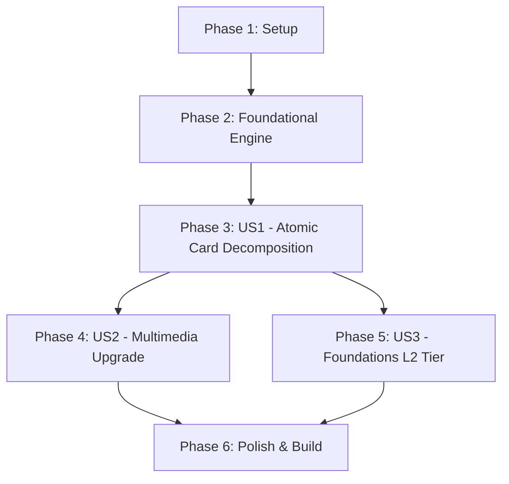

# Tasks: Atomic Cards, Multimedia Upgrade & Foundations Tier

**Input**: Design documents from `specs/002-atomic-media-foundations/` (spec.md, plan.md, data-model.md, contracts/, research.md, quickstart.md)

---

## Phase 1: Setup (Shared Infrastructure)

**Purpose**: Sincronização de esquemas, constituição e ambiente de validação

- [X] T001 [P] Validar esquemas JSON de contratos em `specs/002-atomic-media-foundations/contracts/card-schema.json` e `manifest-schema.json`
- [X] T002 Sincronizar governança da Constituição v1.4.0 em `.specify/memory/constitution.md` para incluir a regra de atomicidade estrita e nível `level::l2-fundamental`

---

## Phase 2: Foundational (Blocking Prerequisites)

**Purpose**: Atualização do motor de validação e compilação que desbloqueia a geração e refatoração de cartões

**⚠️ CRITICAL**: Nenhuma alteração de cards pode começar antes da conclusão desta fase.

- [X] T003 Atualizar validador em `src/utils/validator.js` para aceitar `level::l2-fundamental` em `TAG_LEVEL_REGEX`
- [X] T004 Adicionar verificação de atomicidade de pergunta em `src/utils/validator.js` (detectar e sinalizar múltiplas interrogações ou conectivos de perguntas compostas)
- [X] T005 [P] Atualizar CSS e badges de senioridade em `src/generator.js` adicionando tema e cores para `level::l2-fundamental` (badge esmeralda `#10b981`)
- [X] T006 [P] Garantir encapsulamento responsivo de micro-vídeos (`<video>`) e SVGs inline em `src/generator.js` e `src/utils/media-resolver.js`
- [X] T007 Atualizar suíte de testes automatizados em `test/validate-cards.test.js` para validar novas regras de atomicidade e tags L2

**Checkpoint**: Motor de validação e geração pronto e testado. A implementação das User Stories pode iniciar.

---

## Phase 3: User Story 1 - Atomic Flashcards Decomposition (Priority: P1) 🎯 MVP

**Goal**: Decompor todos os 141 flashcards existentes contendo perguntas compostas em cartões uniconceituais atômicos (<30s de avaliação).

**Independent Test**: Executar `npm test` e verificar que nenhum cartão possui perguntas compostas, e cada card avalia apenas 1 conceito indivisível.

### Implementation for User Story 1
- [X] T008 [US1] Criar script de auditoria e mapeamento de decomposição atômica em `src/utils/atomic-decomposer.js`
- [X] T009 [P] [US1] Decompor cartões compostos de DSA em `decks/01-dsa/` e registrar novos IDs atômicos
- [X] T010 [P] [US1] Decompor cartões compostos de Fundamentos em `decks/02-cs-fundamentals/` e registrar novos IDs atômicos
- [X] T011 [P] [US1] Decompor cartões compostos de System Design em `decks/03-system-design-backend/` e registrar novos IDs atômicos
- [X] T012 [P] [US1] Decompor cartões compostos de Behavioral/SRE em `decks/04-behavioral-engineering/` e registrar novos IDs atômicos
- [X] T013 [US1] Sincronizar todos os novos `card_ids` gerados no `syllabus_manifest.json`
- [X] T014 [US1] Executar validação automatizada `npm test` para garantir conformidade de 100% dos cards atômicos

**Checkpoint**: Baralho 100% atômico e testado. User Story 1 entregue com sucesso!

---

## Phase 4: User Story 2 - High-Impact Multimedia Upgrade (Priority: P2)

**Goal**: Substituir tabelas puramente textuais por micro-vídeos em loop (`<video>`) e diagramas vetoriais SVG responsivos em tópicos com dinamismo algorítmico e arquitetural.

**Independent Test**: Renderizar cards em ambiente móvel e desktop, garantindo reprodução contínua e sem áudio de vídeos e renderização nítida de SVGs com `viewBox`.

### Implementation for User Story 2
- [X] T015 [P] [US2] Mapear subtópicos prioritários para micro-vídeos e SVGs (Árvores, Grafos, Caches, TCP, Raft, Kafka, Consistência)
- [X] T016 [P] [US2] Injetar micro-vídeos em loop em cards de algoritmos e transições de estado em `decks/01-dsa/`
- [X] T017 [P] [US2] Injetar diagramas vetoriais SVG responsivos e micro-vídeos em `decks/02-cs-fundamentals/`
- [X] T018 [P] [US2] Injetar topologias de arquitetura em SVG e micro-vídeos em `decks/03-system-design-backend/`
- [X] T019 [US2] Validar links remotos HTTPS e integridade de assets locais via `npm test`

**Checkpoint**: Conteúdo multimídia de alto impacto operacional nos cartões dinâmicos.

---

## Phase 5: User Story 3 - Foundations Tier (`level::l2-fundamental`) (Priority: P3)

**Goal**: Criar cartões introdutórios de nivelamento com analogias do mundo real e primeiros princípios para cada subtópico do syllabus.

**Independent Test**: Filtrar o baralho no Anki com `tag:level::l2-fundamental` e validar que 100% dos subtópicos possuem entrada intuitiva desmistificadora.

### Implementation for User Story 3
- [X] T020 [P] [US3] Redigir e integrar cartões `level::l2-fundamental` para subtópicos de `decks/01-dsa/`
- [X] T021 [P] [US3] Redigir e integrar cartões `level::l2-fundamental` para subtópicos de `decks/02-cs-fundamentals/`
- [X] T022 [P] [US3] Redigir e integrar cartões `level::l2-fundamental` para subtópicos de `decks/03-system-design-backend/`
- [X] T023 [P] [US3] Redigir e integrar cartões `level::l2-fundamental` para subtópicos de `decks/04-behavioral-engineering/`
- [X] T024 [US3] Registrar os novos `card_ids` L2 no `syllabus_manifest.json` e validar via `npm test`

**Checkpoint**: Nível de fundamentos completo, cobrindo todos os 108 subtópicos.

---

## Phase 6: Polish & Cross-Cutting Concerns

**Purpose**: Compilação final dos baralhos, validação e documentação

- [X] T025 [P] Atualizar documentação em `README.md` com a nova taxonomia L2, diretrizes multimídia e contagem atualizada de cards
- [X] T026 Executar suíte completa de testes automatizados `npm test`
- [X] T027 Executar compilação consolidada `npm run build` gerando `MAANG_Engineering_Mastery.apkg`
- [X] T028 [P] Executar compilações modulares por fase (`node src/generator.js --phase <fase>`)
- [X] T029 Validar importação no Anki Desktop e AnkiDroid seguindo `quickstart.md`

---

## Dependencies & Execution Order

---

## Implementation Strategy

### MVP First (User Story 1 - Atomic Decomposition)
1. Concluir Setup + Foundational (atualizações de validador e CSS).
2. Executar User Story 1 (decomposição atômica de todas as perguntas compostas).
3. Validar retenção e testes (`npm test`). **Este é o MVP crítico que resolve o feedback imediato dos usuários**.

### Incremental Delivery
1. **Entrega 1 (MVP)**: Baralho 100% atômico com IDs consistentes e validação rigorosa.
2. **Entrega 2 (Visual)**: Elevação multimídia com micro-vídeos e SVGs responsivos nos tópicos dinâmicos.
3. **Entrega 3 (Foundations)**: Expansão curricular com o nível `level::l2-fundamental` cobrindo o zero-to-hero completo.
