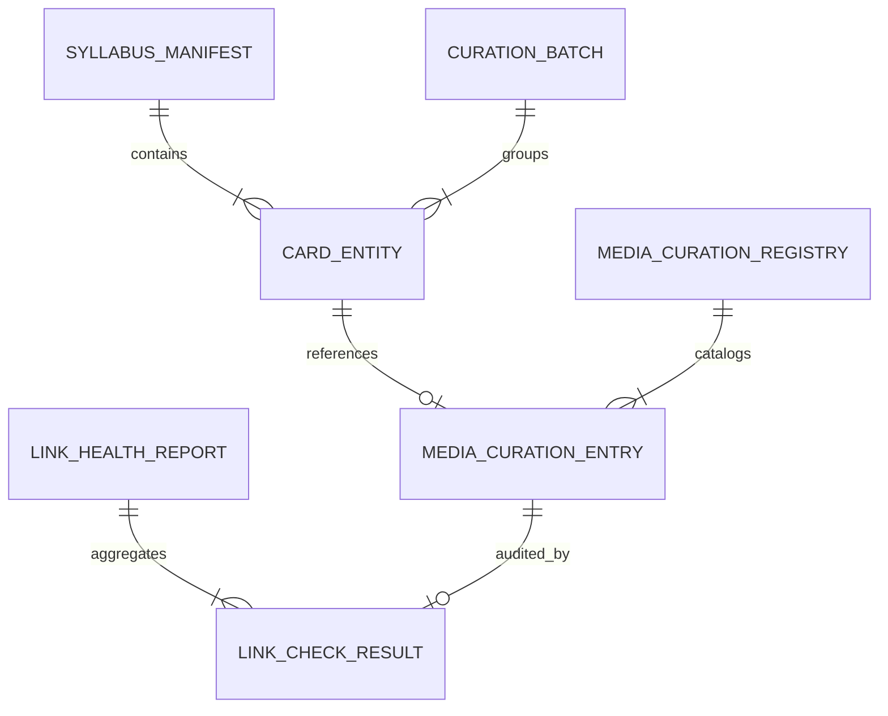
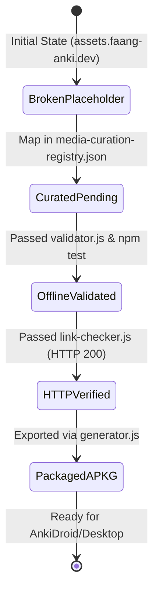

# Data Model: Public Multimedia Curation & Resilient Visual Engine

**Feature Branch**: `003-public-multimedia-curation`  
**Date**: 2026-08-24  
**Status**: Complete  

---

## 1. Entity Overview



---

## 2. Entities & Schema Specifications

### 2.1 Media Curation Registry (`media-curation-registry.json`)

The central inventory tracking all curated media assets across the 550 cards.

| Field | Type | Required | Description | Constraints / Validation |
|---|---|---|---|---|
| `version` | `string` | Yes | Registry schema version | e.g. `"1.0.0"` |
| `last_updated` | `string` | Yes | ISO 8601 timestamp | UTC formatted timestamp |
| `stats` | `object` | Yes | Aggregate metrics | `{ total_cards, p1_video_count, p2_svg_count, p2_table_count }` |
| `cards` | `object` | Yes | Map of `card_id` $\to$ `MediaCurationEntry` | Keys must match canonical ID format (`/^[A-Z0-9]+-[A-Z0-9]+-[A-Z0-9]+-[0-9]{3}$/`) |

#### `MediaCurationEntry` Object

| Field | Type | Required | Description | Constraints / Validation |
|---|---|---|---|---|
| `card_id` | `string` | Yes | Canonical Card ID | Unique identifier (e.g. `DSA-STRUCT-ARRAY-000`) |
| `subtopic_id` | `string` | Yes | Subtopic slug from manifest | e.g. `arrays-dynamic` |
| `concept` | `string` | Yes | Specific atomic concept covered | Concise technical description (e.g. `Array Contiguous Memory Indexing`) |
| `tier` | `string` | Yes | Pedagogical visual tier | One of: `P1_MICRO_VIDEO`, `P2_RESPONSIVE_SVG`, `P2_TABLE_FALLBACK`, `LOCAL_ASSET` |
| `url` | `string` | Conditional | Remote media URL | Required if `tier === "P1_MICRO_VIDEO"`. Must start with `https://` (no placeholder domains). |
| `media_type` | `string` | Yes | MIME Type or format indicator | One of: `video/mp4`, `video/webm`, `image/svg+xml`, `image/webp`, `image/gif`, `image/png`, `inline_svg` |
| `attribution` | `string` | Yes | Originating author / source | e.g. `Wikimedia Commons / User:LucasVB`, `Official Go Documentation`, `Open Data Structures` |
| `license` | `string` | Yes | Legal / open-source license | e.g. `Public Domain`, `CC-BY-4.0`, `CC-BY-SA-4.0`, `MIT`, `Educational Fair Use` |
| `caption` | `string` | Yes | Pedagogical caption in PT-BR | Must explain the visual dynamics clearly; max 200 characters |
| `status` | `string` | Yes | Curation lifecycle state | One of: `verified`, `pending`, `deprecated` |
| `last_verified` | `string` | No | ISO 8601 verification date | Timestamp of last successful HTTP 200 check |

---

### 2.2 Link Health Report (`link-health-report.json`)

Output artifact generated by `npm run test:links` (`src/utils/link-checker.js`).

| Field | Type | Required | Description |
|---|---|---|---|
| `timestamp` | `string` | Yes | Execution timestamp in ISO 8601 |
| `total_audited` | `integer` | Yes | Total distinct media URLs inspected |
| `passed_count` | `integer` | Yes | Count of URLs returning HTTP 200 with valid Content-Type |
| `failed_count` | `integer` | Yes | Count of unreachable or failing URLs |
| `duration_ms` | `number` | Yes | Total wall-clock audit duration in milliseconds |
| `results` | `array` | Yes | Array of `LinkCheckResult` objects |

#### `LinkCheckResult` Object

| Field | Type | Required | Description |
|---|---|---|---|
| `card_id` | `string` | Yes | Card ID containing the URL |
| `file_path` | `string` | Yes | Repository-relative path to the markdown card |
| `url` | `string` | Yes | Audited remote HTTPS URL |
| `http_status` | `integer` | Yes | HTTP Response status code (e.g. 200, 404, 500) |
| `content_type` | `string` | Yes | Received `Content-Type` header (e.g. `video/mp4`) |
| `latency_ms` | `number` | Yes | Round-trip request time in milliseconds |
| `passed` | `boolean` | Yes | `true` if status is 200 and Content-Type matches media |
| `error_message` | `string` | No | Error details if network timeout or HTTP failure occurred |

---

### 2.3 Card Media Reference (Markdown & HTML Syntax)

The concrete syntax rules embedded in card markdown files (`decks/**/*.md`).

#### A. Micro-Video Looping Element (P1)
```html
<video autoplay loop muted playsinline webkit-playsinline disableRemotePlayback>
  <source src="https://example.org/valid-public-animation.webm" type="video/webm">
  <source src="https://example.org/valid-public-animation.mp4" type="video/mp4">
</video>
<p>Visualização: Rotação simples à direita em árvore AVL restaurando o fator de balanceamento em O(1).</p>
```

#### B. Responsive Inline SVG Element (P2)
```html
<svg viewBox="0 0 680 260" width="100%" height="auto" xmlns="http://www.w3.org/2000/svg">
  <!-- Semantic diagram components -->
</svg>
<p>Visualização: Estrutura do nó Red-Black e transição de cores após inserção.</p>
```

---

### 2.4 Curation Batches (`CurationBatch`)

Curriculum-based partitioning for execution and incremental gate verification:

| Batch ID | Deck Area | Card Count | Scope & Focus | Verification Gate |
|---|---|---|---|---|
| **BATCH_01_DSA** | `decks/01-dsa` | 180 cards | Data Structures & Algorithms | `npm test` + `npm run test:links` + DSA APKG build |
| **BATCH_02_CS_FND** | `decks/02-cs-fundamentals` | 97 cards | OS, Memory, Networks, Databases | `npm test` + `npm run test:links` + CS APKG build |
| **BATCH_03_SYS_DSG** | `decks/03-system-design-backend` | 94 cards | Distributed Systems, Kafka, HLD | `npm test` + `npm run test:links` + Master APKG build |

---

## 3. Lifecycle State Transitions


