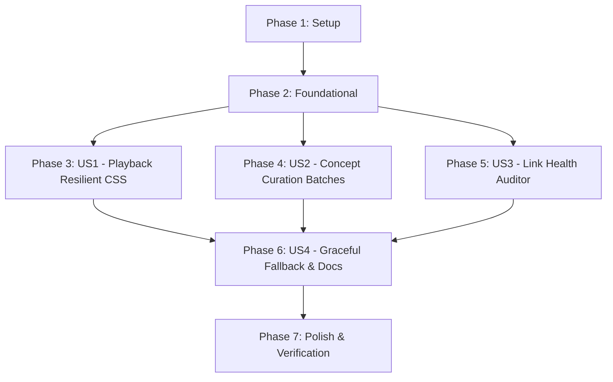

# Tasks: Public Multimedia Curation & Resilient Visual Engine

**Feature**: Public Multimedia Curation & Resilient Visual Engine  
**Branch**: `003-public-multimedia-curation` | **Date**: 2026-08-24  
**Specification**: [spec.md](./spec.md) | **Plan**: [plan.md](./plan.md) | **Data Model**: [data-model.md](./data-model.md)

---

## Phase 1: Setup (Shared Infrastructure)

**Purpose**: Project initialization, registry setup, and npm script configuration.

- [X] T001 Initialize canonical media registry `media-curation-registry.json` conforming to [media-curation-registry.schema.json](./contracts/media-curation-registry.schema.json)
- [X] T002 [P] Configure npm scripts to add `"test:links": "node src/utils/link-checker.js"` in `package.json`

---

## Phase 2: Foundational (Blocking Prerequisites)

**Purpose**: Core validation and resilient rendering infrastructure that MUST be complete before user stories.

**⚠️ CRITICAL**: No card curation or batch execution can begin until foundational engine updates are in place.

- [X] T003 [P] Update `src/utils/validator.js` to strictly reject placeholder domains (`assets.faang-anki.dev`, `example.com`, `example.org`, `localhost`, `placeholder.com`) and enforce secure HTTPS protocols
- [X] T004 [P] Refactor `.card-container video` and `.media-container` styles in `src/generator.js` to remove `#000` background, set transparent background, and ensure theme-integrated borders
- [X] T005 [P] Implement live network reachability auditor `src/utils/link-checker.js` with worker pool (8 concurrent), timeout (5000ms), 2x retry on 429/5xx, and CLI flags per [link-checker-cli.schema.json](./contracts/link-checker-cli.schema.json)
- [X] T006 Implement structured JSON report output conforming to [link-health-report.schema.json](./contracts/link-health-report.schema.json) in `src/utils/link-checker.js`

**Checkpoint**: Foundation ready — offline guardrails, resilient CSS, and link audit engine operational.

---

## Phase 3: User Story 1 - Flawless Online-Enhanced Multimedia Playback (Priority: P1) 🎯 MVP

**Goal**: Ensure all looping micro-videos and animations render and execute fluidly across Anki Desktop and AnkiDroid with mobile-ready flags (`autoplay loop muted playsinline webkit-playsinline disableRemotePlayback`) and transparent theme-integrated containers.

**Independent Test**: Build decks via `npm run build` and inspect generated HTML/APKG samples in Dark and Light modes to verify zero `#000` background boxes and proper mobile video flags.

### Tests for User Story 1
- [X] T007 [P] [US1] Add unit tests in `test/validate-cards.test.js` verifying transparent video CSS styles and mandatory mobile video flags

### Implementation for User Story 1
- [X] T008 [US1] Update card rendering template in `src/generator.js` to ensure video tags inject all required mobile playback attributes and responsive container classes
- [X] T009 [US1] Update `src/utils/media-resolver.js` to preserve responsive container formatting and attribute integrity during card compilation

**Checkpoint**: User Story 1 complete — video rendering engine is 100% resilient and mobile-ready.

---

## Phase 4: User Story 2 - Strict Card-by-Card Concept Curation (Priority: P2)

**Goal**: Eradicate all 371 occurrences of `assets.faang-anki.dev` and map each card in `media-curation-registry.json` and markdown files to exact single-concept public assets (P1 videos / animations, P2 responsive SVGs, P2 tables) across 3 curricular batches.

**Independent Test**: Run `npm test` to verify 0 placeholder URLs, and audit subtopic cards to ensure visual diagrams strictly match the atomic question and key terms.

### Tests for User Story 2
- [X] T010 [P] [US2] Add unit tests in `test/validate-cards.test.js` asserting schema conformity of `media-curation-registry.json` and 0 occurrences of placeholder domains

### Implementation for User Story 2
- [X] T011 [P] [US2] Curate Batch 1 (DSA: 180 cards) in `media-curation-registry.json` and `src/utils/media-catalog.js` mapping data structures and algorithms to verified public looping micro-videos and responsive SVGs
- [X] T012 [US2] Update and replace all placeholder media URLs across 180 DSA cards in `decks/01-dsa/**/*.md` with verified public assets, responsive SVGs, and semantic captions (depends on T011)
- [X] T011a [P] [US2] Remediate Batch 1 (DSA): Replace broken Wikimedia URLs and `<video src="...svg">` tags with verified responsive inline SVGs from `src/utils/media-catalog.js` in `media-curation-registry.json`
- [X] T012a [US2] Update Batch 1 (DSA) cards in `decks/01-dsa/**/*.md` with responsive inline SVGs and semantic captions (depends on T011a)
- [X] T013 [P] [US2] Curate Batch 2 (CS Fundamentals: 97 cards) in `media-curation-registry.json` and `src/utils/media-catalog.js` mapping OS, memory, networks, and databases to verified public assets and responsive SVGs
- [X] T014 [US2] Update and replace all placeholder media URLs across 97 CS Fundamentals cards in `decks/02-cs-fundamentals/**/*.md` with verified public assets, responsive SVGs, and semantic captions (depends on T013)
- [X] T013a [P] [US2] Remediate Batch 2 (CS Fundamentals): Replace broken Wikimedia URLs and `<video src="...svg">` tags with verified responsive inline SVGs in `media-curation-registry.json`
- [X] T014a [US2] Update Batch 2 (CS Fundamentals) cards in `decks/02-cs-fundamentals/**/*.md` with responsive inline SVGs and semantic captions (depends on T013a)
- [X] T015 [P] [US2] Curate Batch 3 (System Design: 94 cards) in `media-curation-registry.json` and `src/utils/media-catalog.js` mapping distributed consensus, Kafka, caching, and scalability to verified public assets and responsive SVGs
- [ ] T016 [US2] Update and replace all placeholder media URLs across 94 System Design cards in `decks/03-system-design-backend/**/*.md` with verified public assets, responsive SVGs, and semantic captions (depends on T015)
- [ ] T017 [US2] Update aggregate stats and canonical entry mappings in `media-curation-registry.json`

**Checkpoint**: User Story 2 complete — all 371 cards curated with single-concept visuals and zero placeholder URLs.

---

## Phase 5: User Story 3 - Active Reachability & Content-Type Guardrails (Priority: P3)

**Goal**: Provide automated network reachability auditing (`npm run test:links`) with batch filtering, 5s timeout, 2x retries on 429/5xx, and structured report emission.

**Independent Test**: Execute `npm run test:links` across all decks and assert exit code 0, 100% HTTP 200 responses, and valid media MIME types recorded in `link-health-report.json`.

### Tests for User Story 3
- [ ] T018 [P] [US3] Add unit tests in `test/validate-cards.test.js` verifying `link-checker.js` CLI parameter parsing, retry logic on HTTP 429/5xx, and report generation

### Implementation for User Story 3
- [ ] T019 [US3] Add batch filtering CLI flag `--deck <path>` in `src/utils/link-checker.js` to enable targeted auditing of individual curricular batches
- [ ] T020 [US3] Execute full network link audit via `npm run test:links` and verify 100% reachability across all curated cards, generating `link-health-report.json`

**Checkpoint**: User Story 3 complete — live link health auditor active and fully integrated into npm scripts.

---

## Phase 6: User Story 4 - Graceful Degradation & Resilient Visual Fallback (Priority: P4)

**Goal**: Ensure layout degrades gracefully under high-latency or offline conditions (quick answer + comparison table + caption without layout shift) and update project documentation.

**Independent Test**: Simulate offline/slow network and verify cards remain 100% readable with no layout shift, and verify documentation in `README.md` and manifests.

### Implementation for User Story 4
- [ ] T021 [P] [US4] Add CSS fallback styling for high-latency / offline video rendering in `src/generator.js` ensuring immediate display of quick answers and comparison tables without layout shift
- [ ] T022 [P] [US4] Update `README.md` to document the Online-Enhanced media architecture, public curation standards, and `npm run test:links` execution guide
- [ ] T023 [US4] Update `syllabus_manifest.json` metadata to reflect completed curation status across all curriculum phases

**Checkpoint**: User Story 4 complete — graceful fallback verified and documentation updated.

---

## Phase 7: Polish & Cross-Cutting Concerns

**Purpose**: End-to-end verification, quality audit, and compilation across all decks.

- [ ] T024 [P] Run full offline validation suite via `npm test` verifying 550 cards, manifest, atomicity, LaTeX math, and zero placeholder domains
- [ ] T025 [P] Run active link reachability audit via `npm run test:links` and validate generated `link-health-report.json` against [link-health-report.schema.json](./contracts/link-health-report.schema.json)
- [ ] T026 Compile Master and Modular `.apkg` packages via `npm run build` verifying clean builds under 5 seconds and package size under 50MB
- [ ] T027 Run quickstart validation scenarios per [quickstart.md](./quickstart.md)

---

## Dependencies & Execution Order

### Phase Dependencies



### User Story Dependencies

- **User Story 1 (P1)**: Can start after Foundational (Phase 2) — Focuses on CSS rendering engine and video attributes.
- **User Story 2 (P2)**: Can start after Foundational (Phase 2) — Curates the 371 cards in 3 curriculum batches (DSA, CS Fundamentals, System Design).
- **User Story 3 (P3)**: Can start after Foundational (Phase 2) — Implements CLI flags and network link auditor execution.
- **User Story 4 (P4)**: Depends on US1, US2, and US3 — Validates graceful fallback, updates manifest and documentation.

### Within Each User Story

- Unit tests written and verified first.
- Data models / registry mappings before markdown content updates.
- Content updates before aggregate stat updates.
- Story complete before moving to next phase checkpoint.

---

## Parallel Opportunities

### Phase 1 & 2 (Setup & Foundational)
```bash
# Run foundational tasks in parallel:
Task T003: "Update src/utils/validator.js to block placeholder domains"
Task T004: "Refactor .card-container video in src/generator.js"
Task T005: "Implement live network reachability auditor in src/utils/link-checker.js"
```

### Phase 4 (Curriculum Curation Batches)
```bash
# Curate batch mappings in parallel:
Task T011: "Curate Batch 1 (DSA: 180 cards) in media-curation-registry.json"
Task T013: "Curate Batch 2 (CS Fundamentals: 97 cards) in media-curation-registry.json"
Task T015: "Curate Batch 3 (System Design: 94 cards) in media-curation-registry.json"
```

### Phase 7 (Polish & Quality Audit)
```bash
# Run validation and build tasks in parallel:
Task T024: "Run full offline validation suite via npm test"
Task T025: "Run active link reachability audit via npm run test:links"
```

---

## Implementation Strategy

### MVP First (User Story 1 Only)
1. Complete Phase 1: Setup (`media-curation-registry.json`, `package.json`).
2. Complete Phase 2: Foundational (`validator.js`, `generator.js` resilient CSS, `link-checker.js`).
3. Complete Phase 3: User Story 1 (playback attribute injection and resilient styles).
4. **STOP and VALIDATE**: Verify zero `#000` black box rendering and mobile flags.

### Incremental Delivery (Curricular Batches)
1. Complete Setup + Foundational → Foundation ready.
2. Complete User Story 1 → Playback engine verified (MVP).
3. Complete User Story 2:
   - Batch 1 (01-DSA, 180 cards) → Validate & compile `MAANG_01-dsa.apkg`.
   - Batch 2 (02-CS-Fundamentals, 97 cards) → Validate & compile `MAANG_02-cs-fundamentals.apkg`.
   - Batch 3 (03-System-Design, 94 cards) → Validate & compile `MAANG_03-system-design-backend.apkg`.
4. Complete User Story 3 → Live link reachability audit (`npm run test:links`).
5. Complete User Story 4 → Documentation, manifest, and graceful fallback.
6. Complete Polish → Full master build (`MAANG_Engineering_Mastery.apkg`).
