# Phase 1 Data Model: AnkiWeb E2E Automation & Visual Layout Guardrails

**Feature Branch**: `004-ankiweb-e2e-automation`  
**Date**: 2026-08-30  
**Status**: Draft  

---

## 1. Entities & Schemas

### 1.1 Card Typology & Sanity Sampling

#### `CardTypology` (Enum)
Categories of visual and pedagogical components required in the sanity deck:
- `L2_FUNDAMENTAL`: Intuitive entry-level card with real-world analogy and `level::l2-fundamental` tag.
- `L3_JUNIOR`: Asymptotic complexity and mechanics card with `level::l3-junior` tag and $O(1)/O(N)$ badges.
- `L4_PLENO_CODE`: Code implementation card with Go/Java snippets in Dark Modern theme and `level::l4-pleno` tag.
- `MICRO_VIDEO`: Card containing `<video>` tag with responsive looping attributes.
- `RESPONSIVE_SVG`: Card containing inline `<svg>` with `viewBox` and `width="100%"`.
- `COMPACT_TABLE`: Card containing Markdown or HTML table with $\le 3$ columns.
- `KATEX_MATH`: Card containing inline `$math$` or block `$$math$$` formulas.
- `DETAILS_ACCORDION`: Card containing `<details><summary>Deep Dive & Walkthrough</summary>`.

#### `SampledCard`
Represents an individual flashcard selected for the sanity deck:
```typescript
interface SampledCard {
  id: string;                      // Canonical ID (e.g. "CS-ARCH-CACHE-001")
  filePath: string;                // Absolute or repo-relative path to .md file
  phase: string;                   // "01-dsa" | "02-cs-fundamentals" | "03-system-design-backend" | "04-behavioral-engineering"
  subtopic: string;                // Subtopic identifier (e.g. "caching-patterns")
  typologiesCovered: CardTypology[]; // List of typologies satisfied by this card
  frontmatter: {
    id: string;
    title: string;
    tags: string[];
  };
  questionRaw: string;
  answerRaw: string;
}
```

#### `SanityDeckManifest`
Manifest consolidating the sampled cards for `MAANG_E2E_Sanity`:
```typescript
interface SanityDeckManifest {
  deckName: "MAANG_E2E_Sanity";
  generatedAt: string;             // ISO-8601 timestamp
  totalCards: number;              // Typically 6 to 10
  coverageMatrix: Record<CardTypology, string>; // Mapping typology -> card ID
  cards: SampledCard[];
  outputApkgPath: string;          // e.g. "MAANG_E2E_Sanity.apkg"
}
```

---

### 1.2 Anki-Connect Integration

#### `AnkiConnectPayload`
Structure of JSON-RPC 2.0 requests dispatched to `http://127.0.0.1:8765`:
```typescript
interface AnkiConnectPayload<T = Record<string, any>> {
  action: "version" | "importPackage" | "sync" | "deleteDecks" | "getDeckNames";
  version: 6;
  params?: T;
}
```

#### `AnkiConnectResponse`
Structure of responses received from Anki-Connect:
```typescript
interface AnkiConnectResponse<R = any> {
  result: R | null;
  error: string | null;
}
```

#### `AnkiConnectDiagnostic`
Diagnostic state produced on connection failure:
```typescript
interface AnkiConnectDiagnostic {
  connected: boolean;
  endpoint: "http://127.0.0.1:8765";
  errorCode: "ECONNREFUSED" | "TIMEOUT" | "UNKNOWN" | null;
  message: string;
  resolutionSteps: string[];
}
```

---

### 1.3 AnkiWeb Authentication & Session State

#### `AnkiWebCredentials`
Local environment credentials loaded from `.env`:
```typescript
interface AnkiWebCredentials {
  user: string;                    // ANKIWEB_USER
  password: string;                // ANKIWEB_PASSWORD
}
```

#### `AnkiWebSessionState`
Playwright persistent storage state (`.auth/ankiweb-session.json`):
```typescript
interface AnkiWebSessionState {
  cookies: Array<{
    name: string;
    value: string;
    domain: string;
    path: string;
    expires: number;
    httpOnly: boolean;
    secure: boolean;
    sameSite: "Strict" | "Lax" | "None";
  }>;
  origins: Array<{
    origin: string;
    localStorage: Array<{ name: string; value: string }>;
  }>;
}
```

---

### 1.4 Visual & Layout Assertions

#### `ViewportProfile`
```typescript
interface ViewportProfile {
  name: "mobile-small" | "mobile-standard" | "desktop-hd";
  width: number;                   // 360 | 390 | 1280
  height: number;                  // 640 | 844 | 720
  deviceScaleFactor: number;       // 2 or 1
  isMobile: boolean;               // true for 360 and 390
}
```

#### `CardVisualAssertionResult`
Individual card inspection metrics:
```typescript
interface CardVisualAssertionResult {
  cardId: string;
  viewport: ViewportProfile;
  side: "front" | "back";
  passed: boolean;
  metrics: {
    scrollWidth: number;
    clientWidth: number;
    hasHorizontalOverflow: boolean; // scrollWidth > clientWidth
    summaryTouchTargetHeight?: number; // >= 44px
    katexErrorCount: number;         // must be 0
    videoElementCount: number;
    videoMissingAttributes: string[]; // must be empty
    highlightJsTokensFound: number;  // > 0 for code blocks
    visualDiffRatio?: number;        // <= maxDiffPixelRatio (0.02)
  };
  screenshotPath?: string;
  errors: string[];
}
```

---

### 1.5 Execution Report

#### `E2EExecutionReport`
Consolidated test execution report:
```typescript
interface E2EExecutionReport {
  suite: "AnkiWeb E2E Automation" | "Local E2E Component Runner";
  timestamp: string;               // ISO-8601
  durationMs: number;
  environment: {
    nodeVersion: string;
    os: string;
    browser: "chromium";
    mode: "cloud-ankiweb" | "local-headless";
    deckName: "MAANG_E2E_Sanity";
  };
  summary: {
    totalCardsTested: number;
    totalAssertions: number;
    passedAssertions: number;
    failedAssertions: number;
    overallStatus: "PASSED" | "FAILED";
  };
  typologiesCovered: Record<CardTypology, boolean>;
  cardResults: CardVisualAssertionResult[];
  artifacts: {
    sanityApkg: string;
    sessionPath?: string;
    screenshotsDir: string;
  };
}
```

---

## 2. State Transitions & Lifecycle

```mermaid
stateDiagram-v2
    [*] --> Sampling: Dynamic Card Selector
    Sampling --> DeckBuilding: 100% Typologies Covered
    DeckBuilding --> AnkiConnectCheck: MAANG_E2E_Sanity.apkg Compiled
    
    state AnkiConnectCheck {
        [*] --> PingAnkiConnect
        PingAnkiConnect --> Diagnostics: ECONNREFUSED
        Diagnostics --> [*]: Fail Fast
        PingAnkiConnect --> ImportApkg: OK (Version 6)
        ImportApkg --> SyncCloud: Package Imported
        SyncCloud --> [*]: Sync Complete
    }

    AnkiConnectCheck --> WebSessionInit: Cloud Ready
    
    state WebSessionInit {
        [*] --> CheckCachedSession: .auth/ankiweb-session.json
        CheckCachedSession --> ValidateSession: Exists
        ValidateSession --> Ready: HTTP 200 / Decks Visible
        CheckCachedSession --> PerformLogin: Missing
        ValidateSession --> PerformLogin: Expired / Redirect
        PerformLogin --> SaveSession: Save storageState
        SaveSession --> Ready
        Ready --> [*]
    }

    WebSessionInit --> CardTesting: Session Active
    
    state CardTesting {
        [*] --> TestFront: Navigate to Deck Study
        TestFront --> AssertFrontLayout: 360px Overflow & Badges
        AssertFrontLayout --> FlipCard: Click Show Answer
        FlipCard --> AssertBackLayout: Video, SVG, Code, KaTeX
        AssertBackLayout --> TestAccordion: Click Details Summary (>=44px)
        TestAccordion --> NextCard: Click Good/Again
        NextCard --> [*]: All Cards Processed
    }

    CardTesting --> Teardown: Testing Complete
    
    state Teardown {
        [*] --> CheckCleanupFlag
        CheckCleanupFlag --> KeepDeck: Default (Auditing)
        CheckCleanupFlag --> DeleteAndSync: Flag --cleanup
        KeepDeck --> GenerateReport
        DeleteAndSync --> GenerateReport
        GenerateReport --> [*]
    }

    Teardown --> [*]: Report Saved (PASSED/FAILED)
```


