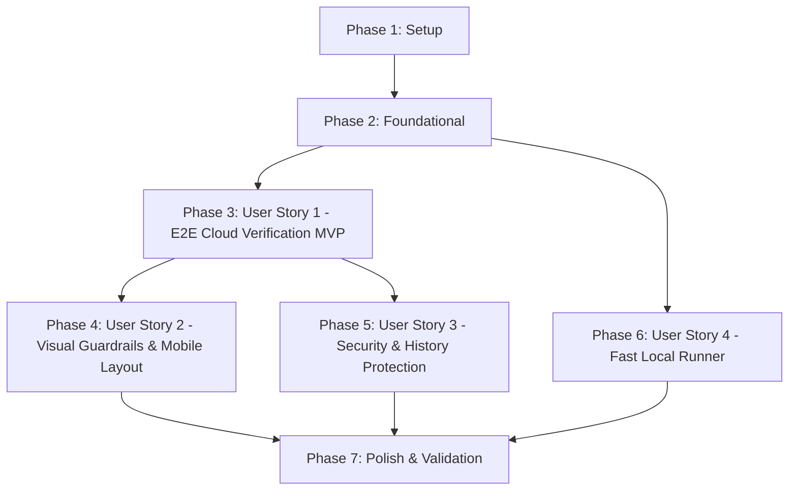

# Tasks: AnkiWeb E2E Automation & Visual Layout Guardrails

**Feature**: AnkiWeb E2E Automation & Visual Layout Guardrails  
**Branch**: `004-ankiweb-e2e-automation` | **Date**: 2026-08-30  
**Specification**: [spec.md](./spec.md) | **Plan**: [plan.md](./plan.md) | **Data Model**: [data-model.md](./data-model.md)

---

## Phase 1: Setup (Shared Infrastructure)

**Purpose**: Project initialization, dependency management, and configuration files.

- [X] T001 Configure project dependencies by adding `@playwright/test` and `dotenv` to `package.json`
- [X] T002 [P] Create `.env.example` in repo root with placeholders for `ANKIWEB_USER` and `ANKIWEB_PASSWORD`
- [X] T003 [P] Update `.gitignore` to strictly exclude `.auth/`, `.env`, `reports/`, and `test-results/`
- [X] T004 [P] Create Playwright configuration `playwright.config.js` with mobile (`360x640`, `390x844`) and desktop (`1280x720`) viewport profiles, snapshot paths, and storage state settings

---

## Phase 2: Foundational (Blocking Prerequisites)

**Purpose**: Core integration clients, dynamic sampler, and layout guardrail engines that MUST be complete before user stories.

**⚠️ CRITICAL**: No user story work can begin until foundational engine components are in place.

- [X] T005 [P] Implement Anki-Connect JSON-RPC client `src/utils/anki-connect.js` with ping, importPackage, sync, deleteDecks, and fail-fast connection diagnostics per [anki-connect-rpc.schema.json](./contracts/anki-connect-rpc.schema.json)
- [X] T006 [P] Implement dynamic representative card sampler `src/e2e/sanity-sampler.js` scanning `decks/` across all curricular phases to select cards covering all 8 typologies conforming to [sanity-sampler.schema.json](./contracts/sanity-sampler.schema.json)
- [X] T007 [P] Refactor `src/generator.js` to export modular HTML rendering helpers and support custom deck packaging for `MAANG_E2E_Sanity.apkg`
- [X] T008 Implement DOM and CSS layout assertion guardrails in `src/e2e/guardrails.js` (0% overflow at 360px, touch target >= 44px, zero `.katex-error`, video attributes, syntax highlight tokens)
- [X] T009 Implement structured JSON report generator and CLI option parser in `src/e2e/orchestrator.js` conforming to [e2e-report.schema.json](./contracts/e2e-report.schema.json) and [e2e-cli.schema.json](./contracts/e2e-cli.schema.json)

**Checkpoint**: Foundation ready — RPC client, dynamic card sampler, guardrails engine, and CLI orchestrator operational.

---

## Phase 3: User Story 1 - Automated End-to-End Flashcard Verification on AnkiWeb (Priority: P1) 🎯 MVP

**Goal**: Deliver an automated pipeline that compiles the sanity deck (`MAANG_E2E_Sanity.apkg`), imports it to Anki Desktop via Anki-Connect, triggers cloud sync, authenticates with AnkiWeb via Playwright, navigates through the deck, and generates a structured test report.

**Independent Test**: Execute `npm run test:e2e` and verify that the sanity deck is generated, synced to AnkiWeb, studied in the browser, and validated with a structured JSON execution report.

### Tests for User Story 1

- [X] T010 [P] [US1] Add unit tests in `test/validate-cards.test.js` verifying Anki-Connect RPC payload generation, sampler typology coverage, and report schema validation

### Implementation for User Story 1

- [X] T011 [US1] Implement AnkiWeb browser automation controller in `src/e2e/ankiweb-runner.js` supporting login flow, navigation to `MAANG_E2E_Sanity` deck, and Front/Back card study progression
- [X] T012 [US1] Integrate Anki-Connect synchronization and AnkiWeb browser runner into the main pipeline in `src/e2e/orchestrator.js`
- [X] T013 [US1] Configure npm script `"test:e2e": "node src/e2e/orchestrator.js"` in `package.json`

**Checkpoint**: User Story 1 complete — full E2E cloud verification pipeline operational from local build to AnkiWeb study validation.

---

## Phase 4: User Story 2 - High-Fidelity Mobile-First Layout & Visual Element Guardrails (Priority: P2)

**Goal**: Enforce strict layout guardrails across mobile viewports (`360x640`, `390x844`): 0% horizontal overflow (`scrollWidth === clientWidth`), `<details><summary>` touch area >= 44px with smooth expansion, Dark Modern syntax tokens, zero `.katex-error`, looping micro-videos, and visual snapshot regression testing against golden baselines.

**Independent Test**: Execute Playwright visual regression suite across viewports and verify zero horizontal overflow at 360px and 100% compliance in visual snapshot comparisons.

### Tests for User Story 2

- [X] T014 [P] [US2] Create Playwright visual regression test spec `test/e2e/e2e-guardrails.test.js` validating layout, responsive viewports, and snapshot diffing

### Implementation for User Story 2

- [X] T015 [P] [US2] Generate and establish golden baseline reference screenshots for all sampled sanity cards in `test/e2e/baselines/`
- [X] T016 [US2] Integrate mobile viewport assertion execution (`360x640`, `390x844`) and evidence screenshot capture into `src/e2e/ankiweb-runner.js`
- [X] T017 [US2] Integrate touch-target >= 44px and accordion toggle verification into `src/e2e/guardrails.js` and `src/e2e/ankiweb-runner.js`
- [X] T018 [US2] Add visual diff snapshot comparator and screenshot artifact saving to `reports/e2e/screenshots/` in `src/e2e/orchestrator.js`

**Checkpoint**: User Story 2 complete — mobile-first visual guardrails and visual regression testing active with evidence screenshots.

---

## Phase 5: User Story 3 - Secure Isolation & SRS History Protection (Priority: P3)

**Goal**: Protect user credentials, session cookies, and study history through persistent session caching (`.auth/ankiweb-session.json`), dedicated test deck isolation (`MAANG_E2E_Sanity`), and clean teardown when `--cleanup` is flagged.

**Independent Test**: Run `npm run test:e2e -- --cleanup` and confirm session caching, zero modification to master decks, and deletion of `MAANG_E2E_Sanity` after sync.

### Implementation for User Story 3

- [X] T019 [P] [US3] Implement session caching and cookie persistence in `.auth/ankiweb-session.json` within `src/e2e/ankiweb-runner.js` with automatic expiration re-authentication
- [X] T020 [US3] Implement deck isolation and `--cleanup` teardown flag handling in `src/utils/anki-connect.js` and `src/e2e/orchestrator.js` to delete test deck and sync when requested
- [X] T021 [US3] Add security audit assertions in `test/validate-cards.test.js` verifying `.env`, `.auth/`, and `reports/` are completely excluded from Git tracking

**Checkpoint**: User Story 3 complete — credentials secured, session cached, and study history protected.

---

## Phase 6: User Story 4 - Fast Local Component Runner for Instant Dev Feedback (Priority: P4)

**Goal**: Provide an in-memory headless component runner executing full DOM and CSS validation in under 3 seconds without network, Anki Desktop, or AnkiWeb dependencies.

**Independent Test**: Run `npm run test:e2e:local` and assert completion in < 3.0 seconds with structured terminal output and zero failures.

### Implementation for User Story 4

- [X] T022 [P] [US4] Implement fast headless local component runner in `src/e2e/local-runner.js` executing DOM guardrails in memory via Playwright `setContent`
- [X] T023 [US4] Configure npm script `"test:e2e:local": "node src/e2e/local-runner.js"` in `package.json`
- [X] T024 [US4] Add performance benchmark assertions in `src/e2e/local-runner.js` ensuring total execution completes in under 3.0 seconds

**Checkpoint**: User Story 4 complete — sub-3-second local feedback loop operational for card and CSS authoring.

---

## Phase 7: Polish & Cross-Cutting Concerns

**Purpose**: Documentation updates, quickstart validation, and end-to-end regression validation across the full test suite.

- [X] T025 [P] Update `README.md` with E2E automation commands, CLI flags, prerequisites, and troubleshooting guide
- [X] T026 [P] Validate full quickstart workflow in [quickstart.md](./quickstart.md) across both local and cloud runner modes
- [X] T027 Execute full test suite `npm test` and `npm run test:e2e:local` ensuring 100% pass rate and zero regressions

---

## Dependencies & Execution Order

### Phase Dependencies



- **Setup (Phase 1)**: No dependencies — can start immediately.
- **Foundational (Phase 2)**: Depends on Setup completion — BLOCKS all user stories.
- **User Story 1 (Phase 3 - MVP)**: Depends on Foundational completion. Delivers the core E2E cloud pipeline.
- **User Story 2 (Phase 4)**: Depends on User Story 1 browser runner infrastructure. Adds high-fidelity mobile guardrails and visual regression testing.
- **User Story 3 (Phase 5)**: Depends on User Story 1 orchestrator and Anki-Connect client. Adds session caching and `--cleanup` teardown.
- **User Story 4 (Phase 6)**: Depends on Foundational phase (`guardrails.js` and `sanity-sampler.js`). Can run in parallel with User Story 1.
- **Polish (Phase 7)**: Depends on completion of all desired user stories.

---

## Parallel Opportunities

### Phase 1 (Setup)
- `T002`, `T003`, and `T004` can be executed concurrently.

### Phase 2 (Foundational)
- `T005` (Anki-Connect), `T006` (Sampler), and `T007` (Generator refactor) can be implemented in parallel.

### User Stories
- Once Phase 2 completes:
  - Developer A can implement User Story 1 (`T010` - `T013`) and proceed to User Story 2 / 3.
  - Developer B can concurrently implement User Story 4 (`T022` - `T024` fast local runner).

### Within User Story 2
- `T014` (test spec) and `T015` (baseline generation) can proceed in parallel with assertion refinements.

---

## Parallel Execution Examples

### Setup Phase Parallel Execution
```bash
# Launch independent configuration tasks in parallel:
Task: "Create .env.example in repo root with placeholders for ANKIWEB_USER and ANKIWEB_PASSWORD" (T002)
Task: "Update .gitignore to strictly exclude .auth/, .env, reports/, and test-results/" (T003)
Task: "Create Playwright configuration playwright.config.js" (T004)
```

### Foundational Phase Parallel Execution
```bash
# Launch independent foundational modules in parallel:
Task: "Implement Anki-Connect JSON-RPC client src/utils/anki-connect.js" (T005)
Task: "Implement dynamic representative card sampler src/e2e/sanity-sampler.js" (T006)
Task: "Refactor src/generator.js to export modular HTML rendering helpers" (T007)
```

---

## Implementation Strategy

### MVP First (User Story 1 Only)
1. Complete Phase 1 (Setup: dependencies, `.env.example`, `.gitignore`, `playwright.config.js`).
2. Complete Phase 2 (Foundational: `anki-connect.js`, `sanity-sampler.js`, `guardrails.js`, `orchestrator.js`).
3. Complete Phase 3 (User Story 1: `ankiweb-runner.js`, E2E cloud orchestration, npm scripts).
4. **STOP and VALIDATE**: Run `npm run test:e2e` to verify the full cloud cycle from sampling to AnkiWeb study.

### Incremental Delivery
1. **Foundation Ready**: Setup + Foundational components operational.
2. **Increment 1 (MVP)**: Deliver User Story 1 — Cloud verification working end-to-end.
3. **Increment 2 (Visual Excellence)**: Deliver User Story 2 — Mobile 360px overflow guardrails, touch targets, and visual regression snapshot diffing.
4. **Increment 3 (Security & Cleanup)**: Deliver User Story 3 — Session caching in `.auth/` and `--cleanup` teardown flag.
5. **Increment 4 (Developer Velocity)**: Deliver User Story 4 — Sub-3-second local runner (`npm run test:e2e:local`).
6. **Increment 5 (Release Polish)**: Update documentation, validate quickstart scenarios, and verify full test suite.
